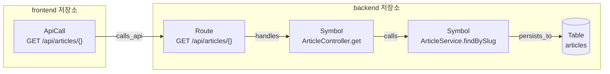

# nunchi

코드베이스 컨텍스트 그래프입니다. 이름은 한국어 낱말인 **눈치**에서 따왔습니다.
말해지지 않은 맥락을 읽어내는 능력을 뜻하는데, 이 도구가 코딩 에이전트에게
제공하려는 것이 바로 그것입니다.

에이전트가 파일을 대량으로 읽어서 코드 구조를 매번 다시 파악하는 대신,
미리 계산해 둔 그래프에 질의하여 **압축된 사실과 정확한 좌표**(`path:line`)를
받도록 만듭니다.

## 무엇을 하는가

프런트엔드와 백엔드가 서로 다른 저장소에 있는 상황을 예로 듭니다.

```typescript
// frontend 저장소의 api.ts
axios.get(`/api/articles/${slug}`);
```

```java
// backend 저장소의 ArticleController.java
@GetMapping("/{slug}")
public ArticleDto get(String slug) { ... }
```

두 코드는 서로를 가리키는 표시가 전혀 없습니다. 파일 이름도 다르고 저장소도
다르므로 grep으로는 이어 볼 수 없습니다. nunchi는 경로 표기를 정규화하여
양쪽을 하나의 그래프로 잇습니다.



사각형이 **노드**이고 화살표가 **엣지**입니다. 노드는 코드에 있는 것이며
저장소, 파일, 심볼, 라우트, API 호출, 테이블 등 열여덟 종류가 있습니다.
엣지는 그 사이의 관계이며 열아홉 종류가 있습니다.

에이전트가 "게시글 조회가 안 된다"고 물으면 nunchi는 이 경로를 따라가며
관련된 좌표만 골라 돌려줍니다. 전체 노드와 엣지 목록은
[학습용 책 2권 0장](book/src/nunchi/00-map.md)에 정리해 두었습니다.

## 빠른 시작

```bash
cargo build --release

./target/release/nunchi init ~/dev/order-api ~/dev/order-web --name web
./target/release/nunchi index
./target/release/nunchi doctor
./target/release/nunchi pack "주문 재시도 로직 수정"
```

Rust 1.90 이상이 필요합니다. macOS와 Windows에서 각각 네이티브로 빌드하며,
크로스 컴파일은 사용하지 않습니다.

## 문서

| 문서 | 읽어야 하는 사람 |
|---|---|
| [사용 안내서](docs/GUIDE.md) | 이 도구를 실제로 쓰려는 사람 |
| [설계 문서](docs/DESIGN.md) | 왜 토큰이 줄어드는지, 왜 이렇게 만들었는지 알고 싶은 사람 |
| [기여 안내서](docs/CONTRIBUTING.md) | 코드를 고치거나 이어받으려는 사람 |
| [학습용 책](book/src/intro.md) | Rust와 이 코드를 처음부터 배우려는 사람 |

처음 접하셨다면 설계 문서를 먼저 읽으시기를 권합니다. 이 도구가 무엇을 하는지
이해하지 못한 상태에서는 사용 안내서의 각 단계가 왜 필요한지 알기 어렵습니다.

## 명령

| 명령 | 하는 일 |
|---|---|
| `nunchi init` | 설정 파일을 만들고 저장소와 언어를 자동으로 감지합니다 |
| `nunchi index [--rebuild] [--watch]` | 인덱스를 만들거나 갱신합니다 |
| `nunchi doctor [--json]` | 인덱스 품질을 검증합니다 |
| `nunchi pack <task> [--json]` | 컨텍스트 팩을 만듭니다. 가장 자주 쓰는 명령입니다 |
| `nunchi find <query> [--json]` | 심볼과 파일을 검색합니다 |
| `nunchi serve` | MCP 서버를 실행합니다 |
| `nunchi bench [--tasks f]` | 토큰 절감량과 재현율을 측정합니다 |
| `nunchi rules [--toml]` | 적용 중인 프레임워크 규칙을 출력합니다 |
| `nunchi tui` | 대화형 화면에서 그래프를 탐색하고 가중치를 조정합니다 |

## 데스크톱 앱

터미널을 쓰지 않고 창에서 같은 일을 할 수 있습니다. 설정 만들기, 인덱싱,
탐색, 팩 미리보기, 설정 편집을 모두 화면에서 합니다.

```bash
cargo install tauri-cli --version "^2"
cargo run -p nunchi-desktop
```

Tauri 2로 만들었으며 운영체제에 이미 들어 있는 웹뷰를 씁니다. 브라우저를 담지
않으므로 실행 파일이 작고, 프런트엔드 프레임워크를 쓰지 않으므로 Node.js도
필요하지 않습니다.

저장소 경로를 손으로 입력하지 않고 폴더 선택 대화상자로 고를 수 있다는 것이
가장 큰 차이입니다. 자세한 설명은 [2권 12장](book/src/nunchi/12-desktop.md)에
있습니다.

## 지원 범위

2026년 9월 기준입니다. 실제로 적용 중인 규칙은 `nunchi rules`로 확인하실 수
있습니다.

| 언어 | 심볼 추출 | 라우트 정의 | 의존성 주입 | 영속 계층 | API 호출 탐지 |
|---|---|---|---|---|---|
| Java | 지원 | Spring | Spring | JPA, MyBatis | RestTemplate |
| TypeScript | 지원 | 없음 | 없음 | 없음 | fetch, axios 계열 |
| JavaScript | 지원 | 없음 | 없음 | 없음 | fetch, axios 계열 |
| Python | 지원 | FastAPI, Flask | 없음 | SQLAlchemy | requests 계열 |
| C# | 지원 (partial 병합) | ASP.NET | 없음 | 없음 | HttpClient |
| Rust | 지원 | 없음 | 없음 | 없음 | 없음 |

API 호출은 프런트엔드만 하는 것이 아닙니다. 백엔드도 다른 서비스나 외부
API를 부르므로 네 언어에서 모두 탐지합니다. 서비스 사이의 호출도 같은
`calls_api` 관계로 이어집니다.

URL이 리터럴이 아니어도 상당 부분 읽습니다. 문자열을 이어 붙인 경로,
상수와 지역 변수, `String.format`의 형식 문자열을 따라갑니다. 경로 상수를
별도 파일에 모아 두는 관례도 지원합니다.

```java
// ApiPaths.java
public static final String ORDERS = "/api/orders";

// OrderGateway.java
rest.getForObject(ApiPaths.ORDERS + "/" + id, OrderDto.class);   // /api/orders/{}
```

같은 이름이 여러 파일에 다른 값으로 있으면 값을 확정하지 않습니다.
`ApiPaths.ORDERS`처럼 한정된 이름은 유일하므로 그대로 해소됩니다.

다만 값이 코드 밖에 있으면 알 수 없습니다. `@Value("${order.api.base}")`로
설정에서 주입받는 경로가 그렇습니다. 메서드를 이어 부르는 형태도 읽지
못합니다. Spring `WebClient`의 `get().uri("/api/x")`나 OkHttp의 요청 빌더가
그런 경우입니다.

프레임워크별로 인식하는 표시는 다음과 같습니다.

| 항목 | 인식하는 것 |
|---|---|
| Spring 라우트 | `@GetMapping`, `@PostMapping`, `@PutMapping`, `@DeleteMapping`, `@PatchMapping`, `@RequestMapping` |
| Spring Bean | `@RestController`, `@Controller`, `@Service`, `@Repository`, `@Component`, `@Configuration` |
| Spring 주입 | `@Autowired`, `@Inject`, `final` 필드, 생성자 파라미터 |
| JPA | `@Entity`, `@Table` |
| MyBatis | `@Select`, `@Insert`, `@Update`, `@Delete`와 XML 매퍼 파일 |
| FastAPI, Flask | `@get`부터 `@patch`까지의 데코레이터와 `@route` |
| SQLAlchemy | `__tablename__` |
| ASP.NET | `[HttpGet]` 계열 다섯 가지와 `[Route]`, `[ApiController]` |
| HTTP 클라이언트 (TypeScript, JavaScript) | `fetch`와 `.get()`부터 `.options()`까지의 메서드 호출 |
| HTTP 클라이언트 (Python) | `.get()`부터 `.patch()`까지의 메서드 호출 |
| HTTP 클라이언트 (Java) | `getForObject`, `getForEntity`, `postForObject`, `postForEntity`, `postForLocation`, `patchForObject`, `delete` |
| HTTP 클라이언트 (C#) | `GetAsync`부터 `PatchAsync`까지의 메서드 호출 |

프레임워크 지원은 설정 파일에 규칙을 추가하여 넓힐 수 있습니다. 바이너리를
다시 빌드할 필요가 없습니다. 자세한 방법은 [사용 안내서](docs/GUIDE.md)에
정리해 두었습니다.

## 개발

```bash
cargo test
cargo build --release
```

크레이트 구조와 작업 절차는 [기여 안내서](docs/CONTRIBUTING.md)를 참고하시기 바랍니다.

## 학습용 책

Rust 문법 28장과 nunchi 코드 설명 12장, 연습문제 57개로 이루어진 책이
`book/`에 있습니다. Rust를 처음 접하는 사람도 읽을 수 있게 썼습니다.

```bash
cargo install mdbook
cd book && mdbook serve --open
```

연습문제는 이렇게 풉니다.

```bash
cd book/exercises
cargo test -p ex_01_04_a
```
