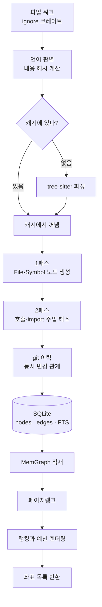
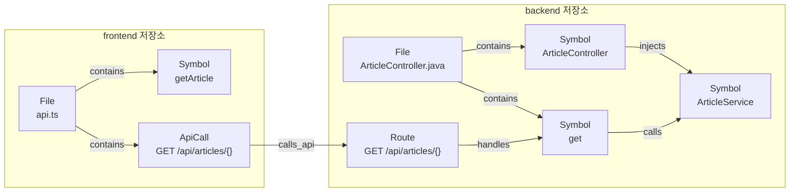

# 0. 지도

> **필요한 문법**: [7.1 모듈과 가시성](../rust/07-1-modules.md)

2권은 nunchi 코드를 실행되는 순서대로 읽습니다. 이 장은 전체 구조를 먼저
보여 드립니다. 지금 세부 사항을 이해하실 필요는 없습니다. 어디에 무엇이
있는지만 기억해 두시면 됩니다.

## 이 프로그램이 하는 일

한 문장으로 줄이면 이렇습니다.

> 코드베이스를 미리 읽어 그래프로 만들어 두고, 에이전트가 물으면 **답이 아니라
> 좌표**를 돌려줍니다.

좌표란 `src/main/java/OrderService.java:88-141` 같은 것입니다. 에이전트는 그
범위만 읽으면 됩니다. 파일 열두 개를 통째로 읽는 대신 필요한 부분만 읽게
만드는 것이 이 프로그램의 전부입니다.

## 크레이트 두 개

```
crates/
├── nunchi-core/     라이브러리입니다. 모든 로직이 여기 있습니다
└── nunchi-cli/      실행 파일입니다. 진입점 역할만 합니다
```

로직을 전부 라이브러리에 둔 이유가 있습니다. CLI와 MCP 서버와 TUI가 **같은
코드를 부르게** 하기 위해서입니다. 셋이 각자 구현하면 결과가 달라지고, TUI에
보이는 것과 에이전트가 받는 것이 어긋나게 됩니다.

## 전체 흐름



윗부분이 인덱싱이고 아랫부분이 질의입니다. 인덱싱은 `nunchi index`가, 질의는
`nunchi pack`과 MCP 서버가 담당합니다.

## 파일 지도

각 파일이 위 흐름의 어디에 해당하는지 정리했습니다.

| 파일 | 하는 일 | 다루는 장 |
|---|---|---|
| `nunchi-cli/main.rs` | 서브커맨드를 받아 나눕니다 | [1장](01-index-command.md) |
| `core/config.rs` | 설정 파일 두 개를 읽고 합칩니다 | [2장](02-config.md) |
| `core/index.rs` | 인덱싱 전체를 조율합니다 | [3장](03-walk.md), [7장](07-resolve.md) |
| `core/lang.rs` | 확장자로 언어를 판별합니다 | [3장](03-walk.md) |
| `core/cache.rs` | 파싱 결과를 내용 해시로 캐싱합니다 | [3장](03-walk.md) |
| `core/extract.rs` | tree-sitter로 심볼을 뽑습니다 | [4장](04-parse.md) |
| `core/framework.rs` | 어노테이션과 데코레이터를 해석합니다 | [5장](05-framework.md) |
| `core/rules.rs` | 프레임워크 규칙을 데이터로 담습니다 | [5장](05-framework.md) |
| `core/mapper_xml.rs` | MyBatis XML 매퍼를 읽습니다 | [5장](05-framework.md) |
| `core/store/` | SQLite에 저장합니다 | [6장](06-store.md) |
| `core/resolve.rs` | 이름으로 참조를 해소합니다 | [7장](07-resolve.md) |
| `core/history.rs` | git 이력에서 동시 변경을 찾습니다 | [7장](07-resolve.md) |
| `core/graph.rs` | 메모리 그래프와 페이지랭크 | [9장](09-graph.md) |
| `core/pack.rs` | 랭킹하고 예산에 맞춰 렌더링합니다 | [8장](08-pack.md) |
| `core/semantic.rs` | 식별자를 분해하고 동의어를 적용합니다 | [8장](08-pack.md) |
| `core/bench.rs` | 절감량을 측정합니다 | [8장](08-pack.md) |
| `cli/watch.rs` | 파일 변경을 감시합니다 | [10장](10-watch.md) |
| `cli/serve.rs` | MCP 서버를 실행합니다 | [11장](11-serve-tui.md) |
| `cli/tui.rs` | 대화형 화면을 그립니다 | [11장](11-serve-tui.md) |

## 데이터 모델

그래프에 무엇이 들어가는지 알아야 나머지가 이해됩니다. 그래프는 **노드**와
**엣지** 두 가지로만 이루어집니다. 노드는 코드에 있는 것이고, 엣지는 노드
사이의 관계입니다.

### 노드는 코드에 있는 것입니다

노드 종류가 열여덟 가지인데, 자주 보게 될 것은 여섯 가지입니다.

| 노드 | 무엇을 가리키는가 | 예 |
|---|---|---|
| `Repo` | 인덱싱 대상 저장소 하나입니다 | `backend`, `frontend` |
| `File` | 소스 파일 하나입니다 | `ArticleController.java` |
| `Symbol` | 파일 안에 선언된 이름 하나입니다. 클래스와 메서드와 함수와 필드가 모두 여기 해당합니다 | `ArticleController`, `findBySlug` |
| `Route` | 서버가 받는 HTTP 엔드포인트 하나입니다. 메서드와 경로를 짝지은 것입니다 | `GET /api/articles/{}` |
| `ApiCall` | 클라이언트가 서버를 부르는 코드 한 군데입니다 | `axios.get('/api/articles/...')` |
| `Table` | 데이터베이스 테이블 하나입니다 | `articles` |

나머지 열두 가지는 `Commit`, `Author`, `Bean`, `Entity`, `ExternalDep` 등이며
해당하는 장에서 그때 설명합니다.

### 엣지는 노드 사이의 관계입니다

엣지에는 방향이 있습니다. **화살표는 출발점에서 도착점으로 읽습니다.**
예를 들어 `Repo -->|contains| File`은 "저장소가 파일을 담고 있다"는 뜻입니다.

| 엣지 | 어디에서 어디로 | 뜻 |
|---|---|---|
| `contains` | `Repo` → `File`, `File` → `Symbol` | 담고 있습니다 |
| `calls` | `Symbol` → `Symbol` | 이 함수가 저 함수를 부릅니다 |
| `injects` | `Symbol` → `Symbol` | 의존성 주입으로 받습니다. Spring의 `@Autowired`가 이것입니다 |
| `handles` | `Route` → `Symbol` | 이 엔드포인트로 온 요청을 저 함수가 처리합니다 |
| `calls_api` | `ApiCall` → `Route` | 클라이언트의 이 호출이 저 엔드포인트로 갑니다 |
| `persists_to` | `Symbol` → `Table` | 이 함수가 저 테이블을 읽거나 씁니다 |
| `co_changed_with` | `File` → `File` | git 이력에서 두 파일이 자주 함께 바뀌었습니다 |

**같은 종류의 노드끼리도 관계가 생깁니다.** 함수가 다른 함수를 부르므로
`Symbol`에서 `Symbol`로 가는 엣지가 있고, 파일이 다른 파일과 함께 바뀌므로
`File`에서 `File`로 가는 엣지가 있습니다.

### 실제 코드로 보면

백엔드와 프런트엔드가 서로 다른 저장소에 있는 상황입니다.

```java
// backend 저장소의 ArticleController.java
@RestController
@RequestMapping("/api/articles")
public class ArticleController {

    private final ArticleService articleService;

    @GetMapping("/{slug}")
    public ArticleDto get(String slug) {
        return articleService.findBySlug(slug);
    }
}
```

```typescript
// frontend 저장소의 api.ts
export const getArticle = (slug: string) =>
  axios.get(`/api/articles/${slug}`);
```

이 두 파일이 그래프에서 이렇게 됩니다.



**이 그림에서 가장 중요한 것은 두 저장소를 잇는 `calls_api` 화살표
하나입니다.** `axios.get`이 있는 줄에서 출발해 `calls_api`와 `handles`를
거치면 백엔드의 `get` 메서드에 도착합니다. 두 저장소에 흩어져 있고 코드에
서로를 가리키는 표시가 전혀 없으므로, grep으로는 찾을 수 없는 연결입니다.

에이전트가 "게시글 조회가 안 된다"고 물으면 nunchi는 이 경로를 따라가며
프런트엔드의 호출부와 백엔드의 핸들러와 그 핸들러가 부르는 서비스까지
한 번에 좌표로 돌려줍니다.

## 두 가지 실행 경로

### 인덱싱

```
nunchi index
  → main.rs 가 설정을 찾습니다
  → index.rs 가 파일을 훑습니다
  → extract.rs 와 framework.rs 가 각 파일을 해석합니다
  → store/sqlite.rs 가 저장합니다
```

### 질의

```
nunchi pack "댓글 삭제"
  → main.rs 가 설정과 인덱스를 엽니다
  → graph.rs 가 그래프를 메모리에 올립니다
  → pack.rs 가 랭킹하고 예산에 맞춰 자릅니다
  → 좌표 목록을 출력합니다
```

MCP 서버(`serve.rs`)도 같은 `pack.rs`를 부릅니다. 인터페이스만 다르고 하는 일은
같습니다.

## 읽는 순서

1장부터 순서대로 읽으시면 실행 흐름을 따라가게 됩니다. 각 장 맨 위에 필요한
문법 장이 적혀 있으니, 모르는 문법이 나오면 그때 1권을 찾아보시면 됩니다.

다만 [1권 1부 소유권](../rust/01-1-ownership.md)은 미리 읽어 두시기를
권합니다. 그것을 모르면 거의 모든 줄에서 막히게 됩니다.
