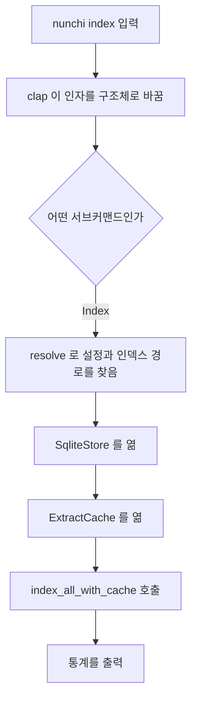

# 1. `nunchi index`를 실행하면

> **필요한 문법**: [2.3 `?` 연산자](../rust/02-3-question-mark.md),
> [5.4 `#[derive]`와 serde 속성](../rust/05-4-derive.md)

터미널에 `nunchi index`를 입력하면 무슨 일이 일어나는지 따라가 보겠습니다.
이 장은 프로그램의 진입점을 다룹니다.

## 무엇을 하는 코드인가

`main.rs`는 하는 일이 적습니다. 세 가지만 합니다.

1. 명령줄 인자를 읽어서 어떤 서브커맨드인지 알아냅니다.
2. 설정 파일과 인덱스 파일의 위치를 찾습니다.
3. 실제 작업을 하는 함수를 부릅니다.

로직은 전부 `nunchi-core`에 있으므로 `main.rs`는 실제 작업을 다른 함수에 넘기는 역할만 합니다.

## 그림



## 한 줄씩

### 인자를 구조체로 받습니다

```rust
#[derive(Parser)]
#[command(name = "nunchi", version)]
struct Cli {
    #[arg(long, global = true)]
    config: Option<PathBuf>,

    #[command(subcommand)]
    command: Command,
}
```

`#[derive(Parser)]`가 핵심입니다. clap이라는 라이브러리가 이 구조체를 보고
**명령줄을 읽는 코드를 자동으로 만들어 줍니다.** 도움말도 함께 만들어집니다.
[5.4장](../rust/05-4-derive.md)에서 다룬 방식입니다.

`config: Option<PathBuf>`는 `--config` 옵션입니다. `Option`이므로 없어도
됩니다([2.1장](../rust/02-1-option.md)).

`global = true`는 어느 서브커맨드에든 붙일 수 있다는 뜻입니다.
`nunchi --config x.toml index`도 되고 `nunchi index --config x.toml`도 됩니다.

### 서브커맨드는 열거형입니다

```rust
#[derive(Subcommand)]
enum Command {
    Init { repos: Vec<PathBuf>, name: Option<String>, force: bool },
    Index { rebuild: bool, watch: bool },
    Doctor { json: bool },
    // ...
}
```

[0.4장](../rust/00-4-data.md)에서 다룬 열거형입니다. **각 가능성이 서로 다른
데이터를 품는다**는 점이 여기서 중요합니다. `Init`은 저장소 목록을 받고
`Index`는 두 플래그를 받습니다.

이렇게 두면 다음 단계가 안전해집니다.

```rust
match cli.command {
    Command::Init { repos, name, force } => cmd_init(repos, name, force),
    Command::Index { rebuild, watch } => cmd_index(cli.config, rebuild, watch),
    Command::Doctor { json } => cmd_doctor(cli.config, json),
    // ...
}
```

`match`가 모든 경우를 다루었는지 컴파일러가 검사합니다
([3.1장](../rust/03-1-match.md)). 새 서브커맨드를 추가하면 여기를 고치지
않는 한 컴파일되지 않습니다. 빠뜨릴 수가 없습니다.

### 로그를 표준 오류로 보냅니다

```rust
tracing_subscriber::fmt()
    .with_writer(std::io::stderr)
    .with_env_filter(...)
    .init();
```

`.with_writer(std::io::stderr)`가 중요합니다. 이 줄이 없으면 로그가 표준
출력으로 나갑니다.

**MCP 서버에서는 표준 출력이 JSON-RPC 전용 통로입니다.** 로그가 섞이면
프로토콜이 깨집니다. 실제로 개발 중에 이 문제를 겪었습니다.
`initialize`는 성공하는데 그다음 `tools/list`에서 응답을 파싱하지 못했습니다.
원인이 로그였습니다.

### 설정과 인덱스 위치를 찾습니다

```rust
fn resolve(config_arg: Option<PathBuf>) -> Result<(Config, PathBuf)> {
    let config_path = match config_arg {
        Some(p) => p,
        None => {
            let cwd = std::env::current_dir()?;
            Config::discover(&cwd).with_context(|| {
                format!("{CONFIG_FILE}을 찾을 수 없습니다. `nunchi init`을 먼저 실행하세요.")
            })?
        }
    };
    let config = Config::load(&config_path)?;
    let base = config_path.parent().unwrap_or(Path::new("."));
    Ok((config, base.join(".nunchi").join("graph.db")))
}
```

세 부분으로 나뉩니다.

**첫째, 설정 파일을 찾습니다.** `--config`로 지정했으면 그것을 쓰고, 아니면
현재 디렉터리에서 위로 올라가며 `nunchi.toml`을 찾습니다. git이 `.git`을
찾는 방식과 같습니다.

**둘째, 오류에 설명을 붙입니다.** `.with_context(...)`가
[2.4장](../rust/02-4-anyhow.md)에서 다룬 것입니다. 파일을 못 찾았을 때
"파일 없음"이 아니라 "`nunchi init`을 먼저 실행하세요"라고 알려 줍니다.

**셋째, 인덱스 경로를 계산합니다.** 설정 파일 옆의 `.nunchi/graph.db`입니다.
설정과 인덱스를 나란히 두면 어느 프로젝트의 인덱스인지 헷갈리지 않습니다.

`?`가 세 번 나옵니다. 각각 "실패하면 여기서 멈추고 오류를 위로 넘겨라"는
뜻입니다([2.3장](../rust/02-3-question-mark.md)).

### 인덱싱을 실행합니다

```rust
fn cmd_index(config_arg: Option<PathBuf>, rebuild: bool, watch: bool) -> Result<()> {
    let (config, db_path) = resolve(config_arg)?;
    let cache_path = db_path.with_file_name("extract-cache.db");

    if rebuild {
        for suffix in ["", "-wal", "-shm"] {
            let p = PathBuf::from(format!("{}{suffix}", db_path.display()));
            let _ = std::fs::remove_file(p);
        }
    }

    let mut store = SqliteStore::open(&db_path)?;
    let mut cache = nunchi_core::cache::ExtractCache::open(&cache_path)?;
    let stats = index::index_all_with_cache(&config, &mut store, Some(&mut cache))?;
    // ... 통계 출력
}
```

`let (config, db_path) = resolve(...)?;`는 튜플을 한 번에 풉니다
([0.4장](../rust/00-4-data.md)).

`--rebuild`일 때 파일을 지우는 부분에 이유가 있습니다. 처음에는
`store.clear()`를 불렀는데, 스키마 버전이 바뀌면 `SqliteStore::open`이 먼저
실패했습니다. 그러면 **안내한 해결책이 동작하지 않는 상태**가 됩니다.
그래서 파일부터 지우게 고쳤습니다.

`let _ = std::fs::remove_file(p);`에서 `let _ =`는 "결과를 무시한다"는
뜻입니다. 파일이 원래 없으면 실패하는데 그것이 정상이므로 무시합니다.

`&mut store`와 `&mut cache`는 [1.3장](../rust/01-3-borrow.md)의 변경 가능한
빌림입니다. 인덱싱이 저장소와 캐시를 모두 바꾸기 때문입니다.

## 왜 이렇게 썼는가

### 왜 `main.rs`에 로직을 두지 않는가

`cmd_index`가 하는 일은 경로 계산과 출력뿐입니다. 실제 인덱싱은
`index_all_with_cache`가 합니다.

이렇게 나누면 MCP 서버와 TUI가 같은 함수를 부를 수 있습니다. 만약 인덱싱
로직이 `main.rs`에 있었다면 서버에서 쓰려고 복사하게 되고, 두 벌이 조금씩
달라지기 시작합니다.

### 왜 캐시를 별도 파일로 두는가

```rust
let cache_path = db_path.with_file_name("extract-cache.db");
```

인덱스는 워크트리마다 다르지만 **캐시는 공유해야 하기 때문입니다.**
브랜치를 오갈 때 파싱 결과를 재사용하려면 캐시가 인덱스와 함께 지워지면
안 됩니다. [3장](03-walk.md)에서 자세히 다룹니다.

## 정리

`main.rs`는 clap이 만들어 준 파서로 인자를 읽고, 설정과 인덱스 위치를 찾은
다음, 실제 작업 함수를 부릅니다. 로직은 전부 라이브러리에 있으므로 CLI와
MCP 서버와 TUI가 같은 코드를 씁니다.

로그를 표준 오류로 보내는 한 줄이 MCP 프로토콜을 지킵니다.

다음 장에서는 설정 파일을 읽는 부분을 봅니다.
