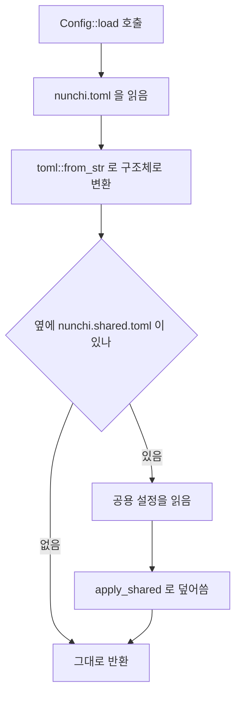

# 2. 설정을 읽는다

> **필요한 문법**: [2.1 `Option<T>`](../rust/02-1-option.md),
> [5.4 `#[derive]`와 serde 속성](../rust/05-4-derive.md)

## 무엇을 하는 코드인가

`config.rs`는 설정 파일을 읽습니다. 다만 파일이 **두 개**라는 점이 특이합니다.

| 파일 | 담는 것 | 커밋 여부 |
|---|---|---|
| `nunchi.toml` | 저장소의 절대 경로 | 하지 않습니다 |
| `nunchi.shared.toml` | 랭킹 가중치, 프레임워크 규칙, 용어 사전 | 합니다 |

두 개로 나눈 이유가 있습니다. 개발용 장비와 업무용 장비에서 **저장소 경로는
다르지만 랭킹 가중치는 같아야 합니다.** 한 파일에 섞여 있으면 경로 때문에
통째로 `.gitignore`에 넣게 되고, 그러면 가중치를 공유할 방법이 없어집니다.

## 그림



공용 파일이 장비별 파일을 **덮어씁니다.** 저장소에 커밋된 값이 기준이 되게
하기 위해서입니다.

## 한 줄씩

### 설정 구조체

```rust
#[derive(Debug, Clone, Serialize, Deserialize)]
pub struct Config {
    pub solution: Solution,
    #[serde(default)]
    pub index: IndexConfig,
    #[serde(default)]
    pub rank: RankWeights,
    #[serde(default)]
    pub framework: crate::rules::FrameworkRules,
    #[serde(default)]
    pub semantic: crate::semantic::Synonyms,
}
```

`#[derive(Deserialize)]`가 TOML을 이 구조체로 바꾸는 코드를 만들어 줍니다.
필드 이름이 TOML의 항목 이름과 그대로 대응됩니다.

`#[serde(default)]`는 **그 항목이 없으면 기본값을 쓴다**는 뜻입니다. 그래서
설정 파일에 `[solution]`만 있어도 읽힙니다. 나머지는 기본값으로 채워집니다.

`solution`에는 `default`가 없습니다. 저장소 경로는 기본값을 만들 수 없으므로
반드시 있어야 합니다. 없으면 파싱이 실패하며, 그것이 의도한 동작입니다.

### 기본값을 함수로 지정합니다

```rust
pub struct IndexConfig {
    pub languages: Vec<String>,
    pub exclude: Vec<String>,
    pub max_file_bytes: u64,
    #[serde(default = "default_max_commits")]
    pub max_commits: usize,
}

fn default_max_commits() -> usize {
    1000
}
```

`usize`의 기본값은 0인데, `max_commits`가 0이면 git 이력을 아예 읽지 않습니다.
우리가 원하는 기본은 1000이므로 함수를 따로 만들어 지정합니다.

함수 이름을 문자열로 적는 것이 이상해 보이지만, 매크로가 코드를 생성할 때
그 이름으로 찾아 넣기 때문입니다.

### 두 파일을 합칩니다

```rust
pub fn load(path: &Path) -> Result<Self> {
    let text = std::fs::read_to_string(path)
        .with_context(|| format!("설정 파일을 읽을 수 없습니다: {}", path.display()))?;
    let mut config: Config = toml::from_str(&text)
        .with_context(|| format!("설정 파일 파싱 실패: {}", path.display()))?;

    let shared_path = path.with_file_name(SHARED_FILE);
    if shared_path.is_file() {
        let shared: SharedConfig = toml::from_str(&std::fs::read_to_string(&shared_path)?)?;
        config.apply_shared(shared);
    }
    Ok(config)
}
```

세 단계입니다.

**첫째, 장비별 파일을 읽습니다.** `?`가 두 번 나오는데 각각 파일 읽기 실패와
파싱 실패를 위로 넘깁니다.

**둘째, 공용 파일이 있는지 봅니다.** `if shared_path.is_file()`이므로 없어도
됩니다. 공용 파일은 선택입니다.

**셋째, 덮어씁니다.** `apply_shared`가 값을 교체합니다.

`let mut config`에 `mut`이 붙은 이유는 아래에서 `apply_shared`가 값을 바꾸기
때문입니다([0.2장](../rust/00-2-variables.md)).

### 덮어쓰기는 `Option`으로 구분합니다

```rust
#[derive(Debug, Clone, Default, Serialize, Deserialize)]
pub struct SharedConfig {
    #[serde(default)]
    pub index: Option<SharedIndex>,
    #[serde(default)]
    pub rank: Option<RankWeights>,
    // ...
}

fn apply_shared(&mut self, shared: SharedConfig) {
    if let Some(i) = shared.index {
        if let Some(v) = i.languages {
            self.index.languages = v;
        }
        // ...
    }
    if let Some(v) = shared.rank {
        self.rank = v;
    }
    // ...
}
```

모든 필드가 `Option`입니다. **적혀 있으면 덮어쓰고 없으면 그대로 둔다**는
뜻을 표현하기 위해서입니다.

`Option`이 아니라 그냥 값이었다면 구분할 수 없습니다. 공용 파일에
`alpha_bm25`를 안 적었을 때 "0.0으로 설정했다"인지 "안 적었다"인지 알 수
없기 때문입니다.

`if let Some(v) = ...`은 [3.2장](../rust/03-2-if-let.md)에서 다룬 문법입니다.
"값이 있을 때만 안쪽을 실행한다"는 뜻입니다.

### 경로가 공용 파일에 들어가지 않게 합니다

```rust
pub fn to_shared(&self) -> SharedConfig {
    SharedConfig {
        index: Some(SharedIndex {
            languages: Some(self.index.languages.clone()),
            exclude: Some(self.index.exclude.clone()),
            max_commits: Some(self.index.max_commits),
        }),
        rank: Some(self.rank),
        framework: Some(self.framework.clone()),
        semantic: Some(self.semantic.clone()),
    }
}
```

공용 파일로 뽑아낼 항목만 골라 담습니다. **`solution.repos`가 들어가지
않는다**는 점이 중요합니다. 그것이 장비별 경로이기 때문입니다.

이 규칙은 테스트로 고정해 두었습니다.

```rust
#[test]
fn shared_roundtrip_has_no_paths() -> Result<()> {
    // ...
    let text = std::fs::read_to_string(&path)?;
    assert!(!text.contains("/secret/path"), "경로가 공용 설정에 들어갔다:\n{text}");
    Ok(())
}
```

나중에 `to_shared`에 필드를 추가하다가 실수로 경로를 넣으면 이 테스트가
잡아냅니다.

`rank`에는 `.clone()`이 없고 `framework`에는 있습니다. `RankWeights`는
`f32` 다섯 개라서 `Copy`이고, `FrameworkRules`는 안에 `Vec`이 있어서
`Copy`가 아니기 때문입니다([1.2장](../rust/01-2-move.md)).

### 설정 파일을 위로 올라가며 찾습니다

```rust
pub fn discover(start: &Path) -> Option<PathBuf> {
    let mut dir = Some(start);
    while let Some(d) = dir {
        let candidate = d.join(CONFIG_FILE);
        if candidate.is_file() {
            return Some(candidate);
        }
        dir = d.parent();
    }
    None
}
```

`while let Some(d) = dir`는 "`dir`에 값이 있는 동안 반복한다"는 뜻입니다
([3.2장](../rust/03-2-if-let.md)).

`d.parent()`는 상위 디렉터리를 돌려주는데, 최상위에 도달하면 `None`이
됩니다. 그러면 반복이 끝나고 `None`을 돌려줍니다.

이 덕분에 프로젝트 안 어느 디렉터리에서든 `nunchi pack`을 그냥 실행할 수
있습니다.

## 왜 이렇게 썼는가

### 왜 공용 파일이 덮어쓰는가

반대로 할 수도 있었습니다. 장비별 값이 공용 값을 덮어쓰게 만들면 각자
취향대로 쓸 수 있습니다.

그렇게 하지 않은 이유는 **랭킹 가중치가 양쪽에서 같아야 하기 때문입니다.**
개인 장비에서 TUI로 가중치를 조정해 커밋했는데 업무 장비에서 다른 값이
쓰이면, 그쪽에서 관찰한 결과를 이쪽에서 재현할 수 없습니다.

### 왜 처음부터 두 파일로 만들지 않았는가

처음에는 한 파일이었습니다. 경로가 들어 있어서 `.gitignore`에 넣었고,
그 결과 가중치를 공유할 수 없다는 사실을 나중에 알아차렸습니다.
`.gitignore`에 "나중에 나눌 것"이라고 적어 두었다가 뒤에 고쳤습니다.

## 정리

설정은 장비별 파일과 공용 파일 두 개로 나뉩니다. 공용 파일의 모든 필드가
`Option`이며, 적혀 있는 것만 덮어씁니다.

`#[serde(default)]`로 대부분의 항목을 생략 가능하게 만들었고, 기본값이
`Default`와 다른 항목은 함수로 지정합니다.

공용 파일에 경로가 들어가지 않는다는 규칙은 테스트로 고정했습니다.

다음 장에서는 파일을 찾아 훑는 부분을 봅니다.
