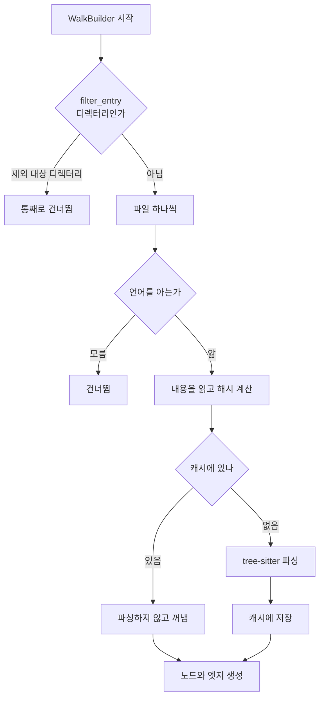

# 3. 파일을 찾는다

> **필요한 문법**: [4.1 클로저](../rust/04-1-closures.md),
> [4.3 `map`, `filter`, `collect` 체인 읽기](../rust/04-3-chains.md)

## 무엇을 하는 코드인가

인덱싱의 첫 단계입니다. 저장소를 훑어서 인덱싱할 파일을 골라냅니다.

간단해 보이지만 두 가지를 잘해야 합니다.

**첫째, 필요 없는 디렉터리에 들어가지 않아야 합니다.** `node_modules`나
`target` 안에는 파일이 수만 개 있습니다. 들어갔다가 나오는 것만으로도
느려집니다.

**둘째, 이미 읽은 적 있는 파일을 다시 파싱하지 않아야 합니다.** 브랜치를
오갈 때 같은 내용을 반복해서 파싱하게 되기 때문입니다.

## 그림



## 한 줄씩

### 디렉터리를 통째로 쳐냅니다

{{#include ../../../crates/nunchi-core/src/index.rs:prune_walk}}

이 부분이 이 장에서 가장 중요합니다. 한 줄씩 봅니다.

```rust
let prune_root = root.to_path_buf();
let prune_set = excludes.clone();
```

두 값을 복사합니다. 왜 복사하는지는 바로 아래 `move` 때문입니다.

```rust
.filter_entry(move |entry| {
```

`move`가 붙은 클로저입니다([4.1장](../rust/04-1-closures.md)). 클로저가
바깥 값의 **소유권을 가져갑니다.**

`move`가 필요한 이유가 있습니다. 워커는 `build()` 이후에도 살아 있으면서
반복 중에 이 클로저를 부릅니다. 클로저가 바깥 값을 빌리기만 하면, 그
빌림이 언제까지 유효한지 컴파일러가 보장할 수 없습니다. 그래서 소유권을
통째로 넘겨야 합니다.

그런데 `excludes`는 이 함수의 다른 곳에서도 쓰입니다. 넘겨 버리면 나중에
쓸 수 없으므로 `.clone()`으로 복사본을 만들어 넘깁니다
([1.4장](../rust/01-4-clone.md)).

```rust
let Some(rel) = npath::relative_to(&prune_root, entry.path()) else {
    return true;
};
```

`let ... else`입니다([3.3장](../rust/03-3-let-else.md)). 저장소 루트 기준
상대 경로를 구하는데, 구할 수 없으면 `true`를 돌려주어 일단 통과시킵니다.

```rust
if entry.file_type().is_some_and(|t| t.is_dir()) {
    !(prune_set.is_match(&rel) || prune_set.is_match(format!("{rel}/")))
} else {
    !prune_set.is_match(&rel)
}
```

디렉터리와 파일을 나눠서 판정합니다. `filter_entry`에서 디렉터리에 `false`를
돌려주면 **그 아래 전체를 건너뜁니다.**

디렉터리를 두 가지 형태로 확인하는 이유가 있습니다. 제외 패턴이
`**/target`처럼 적혀 있을 수도 있고 `**/target/**`처럼 적혀 있을 수도
있기 때문입니다.

### 이 한 줄이 만든 차이

처음에는 `filter_entry` 없이 파일 단위로만 걸렀습니다. 실측하니 이랬습니다.

```
파일  14 인덱싱 / 2106 탐색
```

`target/` 안까지 전부 걸어 들어가고 있었습니다. 실제로 쓸 파일은 14개인데
2,106개를 훑었습니다. 디렉터리 가지치기를 넣은 뒤에는 이렇게 바뀌었습니다.

```
파일  14 인덱싱 / 14 탐색
```

Gradle의 `build/`나 `node_modules/`가 있는 실제 저장소에서는 차이가 훨씬
커집니다.

### 언어를 판별합니다

```rust
let Some(language) = lang::detect(abs) else { continue };
```

확장자로 언어를 알아냅니다. 모르는 확장자면 건너뜁니다.

`lang.rs`는 단순한 대응표입니다.

```rust
pub fn detect(path: &Path) -> Option<&'static str> {
    let ext = path.extension()?.to_str()?.to_ascii_lowercase();
    Some(match ext.as_str() {
        "java" => "java",
        "ts" | "tsx" | "mts" | "cts" => "typescript",
        "py" | "pyi" => "python",
        "cs" => "csharp",
        "rs" => "rust",
        // ...
        _ => return None,
    })
}
```

`&'static str`은 프로그램이 끝날 때까지 사는 문자열입니다
([1.6장](../rust/01-6-lifetimes.md)). 여기서는 코드에 직접 적힌 리터럴이므로
언제나 유효합니다.

`path.extension()?`에서 `?`가 쓰였습니다. 확장자가 없으면 그 자리에서
`None`을 돌려줍니다([2.3장](../rust/02-3-question-mark.md)).

### 내용을 읽고 해시를 계산합니다

```rust
let Ok(bytes) = std::fs::read(npath::to_extended_length(abs)) else { continue };
let Ok(source) = std::str::from_utf8(&bytes) else {
    stats.files_skipped_binary += 1;
    continue;
};

let hash = npath::content_hash(&bytes);
```

`to_extended_length`는 Windows 대응입니다. 경로가 260자를 넘으면 `\\?\`
접두를 붙입니다. Spring의 깊은 패키지 구조와 Gradle의 `build/`가 겹치면
실제로 넘어갑니다.

UTF-8이 아니면 건너뜁니다. 이미지나 바이너리 파일이 여기서 걸러집니다.

### 캐시를 조회합니다

```rust
let cached = cache
    .as_deref_mut()
    .and_then(|c| c.get(&hash, language))
    .and_then(|p| serde_json::from_str::<extract::FileFacts>(&p).ok());

let facts = match cached {
    Some(f) => {
        stats.cache_hits += 1;
        f
    }
    None => {
        stats.cache_misses += 1;
        match extract::extract(sl, abs, source) {
            Ok(f) => {
                if let (Some(c), Ok(payload)) = (cache.as_deref_mut(), serde_json::to_string(&f)) {
                    let _ = c.put(&hash, language, &payload);
                }
                f
            }
            Err(e) => {
                tracing::warn!("추출 실패 {rel}: {e}");
                continue;
            }
        }
    }
};
```

`and_then`이 두 번 이어집니다([4.3장](../rust/04-3-chains.md)). 각각
"앞이 성공했을 때만 다음을 한다"는 뜻입니다.

1. 캐시가 있는가 (`as_deref_mut`)
2. 그 해시가 캐시에 있는가 (`c.get`)
3. 저장된 내용을 구조체로 되돌릴 수 있는가 (`from_str`)

셋 중 하나라도 실패하면 `None`이 되어 파싱하는 쪽으로 갑니다.

`match cached`가 두 경우를 나눕니다. 적중하면 그대로 쓰고, 실패하면
파싱한 뒤 캐시에 넣습니다.

### 캐시 키가 왜 내용 해시인가

이 부분에 중요한 판단이 들어 있습니다.

```rust
let hash = npath::content_hash(&bytes);
```

파일 내용의 해시를 키로 씁니다. **git의 blob SHA를 쓰지 않았습니다.**

이유가 있습니다. Windows에서 `core.autocrlf`가 켜져 있으면 워킹트리는
CRLF이고 git blob은 LF입니다. 두 값이 다릅니다. 우리가 실제로 파싱하는
대상은 워킹트리 내용이므로 그것을 해시해야 자기 일관성이 유지됩니다.

이 선택 덕분에 브랜치를 오갈 때 재파싱이 사라집니다.

| 전환 | 캐시 없음 | 캐시 있음 |
|---|---|---|
| main에서 feature로 (처음) | 1,200개 파싱 | 1,200개 파싱하며 캐시를 채움 |
| feature에서 main으로 (복귀) | 1,200개 파싱 | 파싱 없음 |

실측에서 재인덱싱이 0.65초에서 0.20초로 줄었고 적중률은 100%였습니다.

### 파일 노드를 만듭니다

```rust
let file_id = NodeId::file(repo, &rel);
let mut file_node = Node::new(file_id.clone(), NodeKind::File, &rel, repo);
file_node.path = Some(rel.clone());
file_node.lang = Some(language.to_string());
file_node.content_hash = Some(hash.clone());
file_node.span = Some(Span { start_line: 1, end_line: line_count });
file_node.mtime = file_mtime;
nodes.push(file_node);

edges.push(Edge::new(repo_id.clone(), file_id.clone(), EdgeKind::Contains, Provenance::Fast));
table.insert_file(&rel, file_id.clone());
seen_paths.push(rel.clone());
```

`file_id`가 네 곳에 필요하므로 `.clone()`이 세 번 나옵니다. 여기가
[1.4장](../rust/01-4-clone.md)에서 다룬 "정당한 복사"의 실제 사례입니다.

`Edge`가 `NodeId`를 소유해야 하므로 빌려서는 안 됩니다. 그리고 `NodeId`는
짧은 문자열 하나이므로 복사 비용이 작습니다.

`seen_paths`는 나중에 쓰입니다. **이번 인덱싱에서 발견한 파일 목록**이며,
여기 없는 파일의 노드는 인덱싱이 끝날 때 지웁니다. 삭제하거나 이동한 파일이
인덱스에 영원히 남는 것을 막습니다.

## 왜 이렇게 썼는가

### 왜 `ignore` 크레이트를 쓰는가

직접 디렉터리를 훑을 수도 있었지만 `ignore`는 `.gitignore`를 자동으로
존중합니다. 사용자가 이미 무시하기로 정한 파일을 인덱싱할 이유가 없습니다.

다만 `.gitignore`만으로는 부족합니다. `nunchi.shared.toml`의 `exclude`
패턴을 그 위에 얹는 이유입니다. 생성된 코드가 `.gitignore`에 없는 경우도
있기 때문입니다.

### 왜 캐시를 인덱스와 다른 파일에 두는가

```rust
let cache_path = db_path.with_file_name("extract-cache.db");
```

`--rebuild`로 인덱스를 지워도 캐시는 남아야 하기 때문입니다. 그리고 여러
워크트리가 인덱스는 각자 갖되 캐시는 공유할 수 있습니다.

## 정리

파일 워크에서 중요한 것은 두 가지입니다. `filter_entry`로 디렉터리를 통째로
쳐내면 훑는 파일이 2,106개에서 14개로 줄었습니다. 내용 해시를 키로 하는
캐시는 브랜치를 오갈 때 재파싱을 없앱니다.

캐시 키를 git blob SHA가 아니라 워킹트리 내용 해시로 정한 것은 Windows의
CRLF 변환 때문입니다.

다음 장에서는 파일을 실제로 파싱하는 부분을 봅니다.
