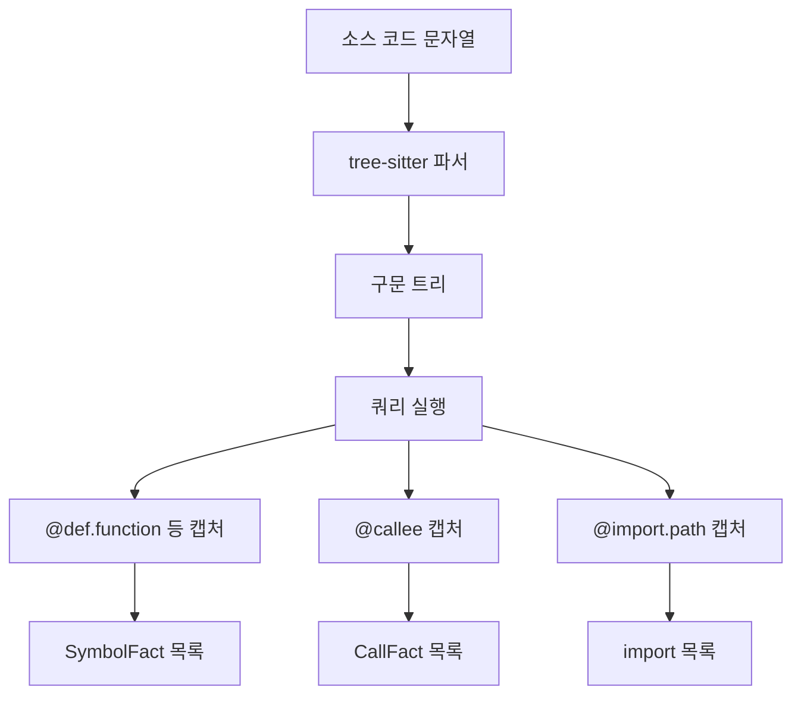

# 4. 코드를 파싱한다

> **필요한 문법**: [8.1 `macro_rules!` 해부](../rust/08-1-macros.md),
> [1.6 수명 표기](../rust/01-6-lifetimes.md)

## 무엇을 하는 코드인가

`extract.rs`는 소스 코드에서 심볼과 호출과 import를 뽑아냅니다. 언어가
다섯 가지이므로 언어마다 파서가 필요한데, 직접 만들지 않고 **tree-sitter**를
씁니다.

tree-sitter는 소스 코드를 트리로 바꿔 주는 라이브러리입니다. 문법 정의는
언어마다 별도 크레이트로 나와 있으므로 가져다 쓰기만 하면 됩니다.

## 그림



## 한 줄씩

### 언어를 열거형으로 다룹니다

```rust
#[derive(Clone, Copy, PartialEq, Eq, Debug)]
pub enum SupportedLang {
    Java,
    TypeScript,
    Rust,
    Python,
    CSharp,
}
```

문자열 대신 열거형을 쓰는 이유는 [0.4장](../rust/00-4-data.md)에서 다룬
것과 같습니다. 없는 언어를 실수로 적을 수 없습니다.

```rust
fn language(self, path: &Path) -> Language {
    match self {
        Self::Java => tree_sitter_java::LANGUAGE.into(),
        Self::Rust => tree_sitter_rust::LANGUAGE.into(),
        Self::Python => tree_sitter_python::LANGUAGE.into(),
        Self::CSharp => tree_sitter_c_sharp::LANGUAGE.into(),
        Self::TypeScript => {
            let is_tsx = path.extension()
                .and_then(|e| e.to_str())
                .is_some_and(|e| e.eq_ignore_ascii_case("tsx")
                    || e.eq_ignore_ascii_case("jsx"));
            if is_tsx {
                tree_sitter_typescript::LANGUAGE_TSX.into()
            } else {
                tree_sitter_typescript::LANGUAGE_TYPESCRIPT.into()
            }
        }
    }
}
```

TypeScript만 두 갈래입니다. JSX 문법이 들어간 파일은 다른 문법 정의를
써야 하기 때문입니다.

`.into()`는 [5.3장](../rust/05-3-from-into.md)에서 다룬 변환입니다.
크레이트가 주는 값을 tree-sitter의 `Language` 타입으로 바꿉니다.

### 쿼리로 원하는 것만 뽑습니다

구문 트리를 직접 순회할 수도 있지만, tree-sitter는 **쿼리**라는 더 편한
방법을 제공합니다. 쿼리는 별도 파일에 적습니다.

```scheme
; queries/java.scm
(class_declaration name: (identifier) @name) @def.class
(method_declaration name: (identifier) @name) @def.method

(import_declaration (scoped_identifier) @import.path) @import

(method_invocation name: (identifier) @callee)
```

읽는 법은 이렇습니다. `(class_declaration name: (identifier) @name)`은
"클래스 선언을 찾고, 그 안의 이름 부분에 `@name`이라는 표를 붙여라"는
뜻입니다.

`@def.class`는 선언 전체에 붙습니다. 시작 줄과 끝 줄을 계산하는 데
씁니다.

### 쿼리가 틀리면 실행 중에 실패합니다

이것이 tree-sitter 쿼리에서 주의할 점입니다. 잘못된 노드 타입을 적어도 컴파일이
됩니다. 문법 파일은 그냥 문자열이기 때문입니다.

그래서 테스트로 막았습니다.

```rust
#[test]
fn all_queries_compile() {
    for lang in [
        SupportedLang::Java,
        SupportedLang::TypeScript,
        SupportedLang::Rust,
        SupportedLang::Python,
        SupportedLang::CSharp,
    ] {
        let language = lang.language(Path::new("x.rs"));
        Query::new(&language, lang.query_source())
            .unwrap_or_else(|e| panic!("{lang:?} 쿼리 컴파일 실패: {e}"));
    }
}
```

`Query::new`가 쿼리를 검사합니다. 노드 타입이 틀리면 여기서 실패하므로
`cargo test`만 실행해도 발견됩니다.

새 언어를 추가할 때 이 목록에 넣는 것을 잊으면 안 됩니다.

### 파싱하고 캡처를 읽습니다

```rust
pub fn extract(lang: SupportedLang, path: &Path, source: &str) -> Result<FileFacts> {
    let language = lang.language(path);
    let mut parser = Parser::new();
    parser.set_language(&language).context("tree-sitter 언어 설정 실패")?;

    let Some(tree) = parser.parse(source, None) else {
        return Ok(FileFacts { had_parse_error: true, ..Default::default() });
    };

    let query = Query::new(&language, lang.query_source())
        .with_context(|| format!("{lang:?} 쿼리 컴파일 실패"))?;

    let mut facts = FileFacts {
        had_parse_error: tree.root_node().has_error(),
        ..Default::default()
    };
    // ...
}
```

`..Default::default()`는 나머지 필드를 기본값으로 채운다는 뜻입니다.
필드가 많을 때 편합니다.

파싱이 실패해도 `Err`를 돌려주지 않습니다. `had_parse_error`에 표시만
하고 빈 결과를 줍니다. **파일 하나 때문에 인덱싱 전체가 멈추면 안 되기
때문입니다.**

`tree.root_node().has_error()`는 부분적으로 실패한 경우를 잡습니다.
tree-sitter는 오류가 있어도 최대한 트리를 만들어 내므로, 파싱은 되었지만
일부가 깨진 상태를 이렇게 확인합니다.

### 캡처를 종류별로 나눕니다

```rust
while let Some(m) = matches.next() {
    let mut def_node: Option<(Node, &str)> = None;
    let mut name: Option<String> = None;
    let mut sub: Option<String> = None;
    let mut sup: Option<String> = None;

    for cap in m.captures {
        let cap_name = &query.capture_names()[cap.index as usize];
        let text = cap.node.utf8_text(bytes).unwrap_or_default();

        if let Some(kind) = cap_name.strip_prefix("def.") {
            def_node = Some((cap.node, kind));
        } else {
            match *cap_name {
                "name" => name = Some(text.to_string()),
                "sub" => sub = Some(text.to_string()),
                "super" => sup = Some(text.to_string()),
                "callee" => facts.calls.push(CallFact {
                    callee: text.to_string(),
                    line: cap.node.start_position().row as u32 + 1,
                }),
                "import.path" => {
                    facts.imports.push(text.trim_matches(['"', '\'']).to_string())
                }
                _ => {}
            }
        }
    }
    // ...
}
```

`while let Some(m) = matches.next()`는 [3.2장](../rust/03-2-if-let.md)에서
다룬 문법입니다. 쿼리 결과를 하나씩 꺼냅니다.

`strip_prefix("def.")`가 핵심입니다. 캡처 이름이 `def.class`나
`def.method`처럼 생겼으므로, 접두를 떼면 종류가 남습니다. 새 종류를
추가할 때 Rust 코드를 고칠 필요가 없습니다. 쿼리 파일에 한 줄만 넣으면
됩니다.

`row as u32 + 1`에서 `+1`은 tree-sitter가 0부터 세고 편집기는 1부터 세기
때문입니다. 이것을 잊으면 좌표가 한 줄씩 어긋납니다.

### 시그니처와 문서를 뽑습니다

```rust
fn first_line(node: Node, bytes: &[u8]) -> Option<String> {
    let text = node.utf8_text(bytes).ok()?;
    let line = text.lines().next()?.trim();
    if line.is_empty() {
        return None;
    }
    const MAX: usize = 200;
    Some(if line.chars().count() > MAX {
        let truncated: String = line.chars().take(MAX).collect();
        format!("{truncated}…")
    } else {
        line.to_string()
    })
}
```

정의의 첫 줄을 시그니처로 씁니다. 정확한 시그니처를 만들려면 언어마다
다르게 처리해야 하는데, 첫 줄만으로도 사람이 읽기에 충분합니다.

`chars().count()`를 쓰는 이유가 있습니다. `len()`은 바이트 수이므로 한글이
들어가면 글자 수와 다릅니다. 자를 때도 `chars().take()`를 써야 글자
중간에서 잘리지 않습니다.

```rust
fn preceding_doc(node: Node, bytes: &[u8]) -> Option<String> {
    let prev = node.prev_sibling()?;
    if !prev.kind().contains("comment") {
        return None;
    }
    // ...
}
```

정의 바로 앞의 주석을 문서로 봅니다. `kind().contains("comment")`로 확인하는
이유는 언어마다 이름이 다르기 때문입니다. Rust는 `line_comment`, Java는
`block_comment`처럼 제각각인데 전부 `comment`를 포함합니다.

### C#의 partial 클래스

C#에는 한 타입을 여러 파일에 나눠 쓰는 문법이 있습니다. WinForms에서
`OrderForm.cs`와 `OrderForm.Designer.cs`가 그렇습니다.

```rust
let partial = matches!(lang, SupportedLang::CSharp)
    && def_text(node, bytes).starts_with("partial ");
```

`matches!`는 [3.3장](../rust/03-3-let-else.md)에서 다룬 매크로입니다.
"이 값이 그 모양인가"를 참과 거짓으로 돌려줍니다.

이 표시가 있으면 인덱서가 노드 ID를 다르게 만듭니다.

```rust
let sym_id = if sym.partial {
    NodeId::partial_symbol(repo, &sym.name)   // 경로를 넣지 않습니다
} else {
    NodeId::symbol(repo, &rel, &sym.name)
};
```

경로를 넣지 않으므로 두 파일에 흩어진 같은 타입이 **하나의 노드**가 됩니다.

## 왜 이렇게 썼는가

### 왜 쿼리를 별도 파일에 두는가

쿼리를 Rust 코드 안의 문자열로 둘 수도 있었습니다. 별도 파일로 뺀 이유는
편집이 쉽기 때문입니다. `.scm` 확장자를 알아보는 편집기에서 문법 강조가
되고, 새 언어를 추가할 때 기존 파일을 복사해서 고치면 됩니다.

`include_str!` 매크로가 컴파일 시점에 파일 내용을 문자열로 넣어 줍니다.
실행 중에 파일을 읽지 않으므로 바이너리 하나만 배포하면 됩니다.

### 왜 파싱 실패를 오류로 올리지 않는가

저장소 하나에 파일이 수천 개입니다. 그중 하나가 문법 오류를 갖고 있는 것은
흔한 일입니다. 작성 중이거나, 템플릿이거나, 다른 도구가 생성한 파일일 수
있습니다.

그때마다 인덱싱이 멈추면 쓸 수 없습니다. 그래서 표시만 하고 넘어가되,
`nunchi doctor`가 언어별 파싱 성공률을 보여 줍니다. 실패가 많으면 사람이
알아차릴 수 있습니다.

## 정리

tree-sitter로 다섯 언어를 파싱하고 쿼리로 원하는 부분만 뽑아냅니다. 쿼리는
별도 `.scm` 파일에 두고 `include_str!`로 컴파일 시점에 넣습니다.

쿼리 오류는 컴파일 시점에 잡히지 않으므로 `all_queries_compile` 테스트로
막았습니다.

파싱 실패는 오류로 올리지 않고 표시만 합니다. 파일 하나 때문에 전체가
멈추면 안 되기 때문입니다.

다음 장에서는 어노테이션을 해석하는 부분을 봅니다. tree-sitter만으로는
부족한 지점입니다.
