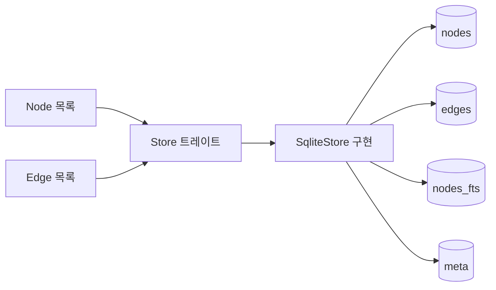

# 6. SQLite에 저장한다

> **필요한 문법**: [5.2 트레이트](../rust/05-2-traits.md),
> [1.3 빌림 `&`와 `&mut`](../rust/01-3-borrow.md)

## 무엇을 하는 코드인가

앞 장들에서 만든 노드와 엣지를 저장합니다. 저장소는 SQLite입니다.

그래프를 다루는데 그래프 데이터베이스를 쓰지 않은 이유가 있습니다. 이 장
마지막에서 설명합니다.

## 그림



`Store`는 약속이고 `SqliteStore`는 구현입니다. 사이에 트레이트를 둔 이유도
뒤에서 설명합니다.

## 한 줄씩

### 트레이트가 저장 계층을 감쌉니다

```rust
{{#include ../../../crates/nunchi-core/src/store/mod.rs:store_trait}}
```

메서드가 여섯 개뿐입니다. **이 개수를 좁게 유지하는 것이 의도된 설계입니다.**

트레이트가 좁으면 다른 저장소로 갈아탈 때 구현할 것이 적습니다. 실측으로는
하루 안에 교체할 수 있는 수준입니다. 메서드가 스무 개였다면 교체가 사실상
불가능해집니다.

[5.2장](../rust/05-2-traits.md)에서 다룬 트레이트가 여기서 실제로 값을
합니다. 다만 이 코드베이스에 트레이트 정의는 이것 **하나뿐**입니다.
필요하지 않은 곳에 미리 만들어 두지 않았습니다.

### 스키마

```sql
CREATE TABLE IF NOT EXISTS nodes (
    id            TEXT PRIMARY KEY,
    key           TEXT NOT NULL,
    kind          TEXT NOT NULL,
    name          TEXT NOT NULL,
    repo          TEXT NOT NULL,
    path          TEXT,
    start_line    INTEGER,
    end_line      INTEGER,
    signature     TEXT,
    doc           TEXT,
    lang          TEXT,
    content_hash  TEXT,
    mtime         INTEGER,
    attrs         TEXT NOT NULL DEFAULT 'null'
);
```

`id`가 기본 키입니다. `NodeId`가 문자열이므로 그대로 씁니다.

`key`가 따로 있는 이유가 Windows 때문입니다. NTFS는 대소문자를 구분하지
않으므로 `Src/App.java`와 `src/app.java`가 같은 파일입니다. `key`에는
소문자로 바꾼 경로를 넣어 두고 조회할 때 씁니다. 표시할 때는 원래 대소문자를
쓰는 `path`를 봅니다.

`attrs`는 JSON 문자열입니다. 노드 종류마다 다른 정보(심볼 종류, Spring
스테레오타입 등)를 담습니다. 컬럼을 늘리는 대신 JSON으로 둔 이유는 종류가
열여덟 가지인데 각자 다른 속성을 갖기 때문입니다.

### WAL 모드

```rust
fn init(conn: Connection) -> Result<Self> {
    conn.pragma_update(None, "journal_mode", "WAL")?;
    conn.pragma_update(None, "synchronous", "NORMAL")?;
    conn.execute_batch(SCHEMA)?;
    // ...
}
```

이 한 줄이 이 프로젝트의 구조를 가능하게 합니다.

WAL 모드에서는 **쓰는 중에도 읽을 수 있습니다.** 인덱서가 쓰기를 하고 있어도
MCP 서버가 질의를 처리할 수 있습니다.

임베디드 그래프 데이터베이스 대부분이 이것을 못 합니다. 한 프로세스만 쓰기로
열 수 있으므로, 인덱서와 서버를 별도 프로세스로 두는 구조 자체가 막힙니다.

### 노드를 넣습니다

```rust
fn upsert_nodes(&mut self, nodes: &[Node]) -> Result<usize> {
    let tx = self.conn.transaction()?;
    {
        let mut ins = tx.prepare(
            "INSERT INTO nodes (id, key, kind, ...) VALUES (?1,?2,?3,...)
             ON CONFLICT(id) DO UPDATE SET
                kind=excluded.kind, name=excluded.name, ...",
        )?;
        // ...
        for n in nodes {
            let key = compare_key(n.path.as_deref().unwrap_or(&n.name));
            ins.execute(params![...])?;
            del_fts.execute(params![n.id.as_str()])?;
            ins_fts.execute(params![...])?;
        }
    }
    tx.commit()?;
    Ok(nodes.len())
}
```

`&mut self`이므로 저장소를 바꿉니다. `nodes: &[Node]`이므로 노드 목록은
읽기만 합니다. 서명만 보고 알 수 있습니다
([1.3장](../rust/01-3-borrow.md)).

`&[Node]`를 쓴 것이 중요합니다. `Vec<Node>`를 받았다면 호출한 쪽에서 소유권을
넘겨야 하고, 그러면 인덱싱 뒤에 노드 목록을 쓸 수 없게 됩니다
([6.1장](../rust/06-1-vec.md)).

`transaction()`으로 묶은 이유는 속도입니다. SQLite는 트랜잭션마다 디스크에
동기화하므로, 노드 하나씩 넣으면 수천 번 동기화합니다. 한 트랜잭션으로 묶으면
한 번입니다.

`ON CONFLICT(id) DO UPDATE`는 upsert입니다. 같은 ID가 이미 있으면 덮어씁니다.
재인덱싱할 때 지우고 다시 넣을 필요가 없습니다.

중괄호 `{ }`로 감싼 부분이 있습니다. `ins` 같은 준비된 구문이 `tx`를 빌리고
있으므로, `tx.commit()`을 부르기 전에 그 빌림이 끝나야 합니다. 블록이 끝나면
빌림도 끝납니다([1.3장](../rust/01-3-borrow.md)).

### 전문 검색 인덱스

```sql
CREATE VIRTUAL TABLE IF NOT EXISTS nodes_fts USING fts5(
    id UNINDEXED,
    name,
    tokens,
    signature,
    doc,
    path,
    tokenize = 'unicode61'
);
```

FTS5는 SQLite에 내장된 전문 검색입니다. 별도 검색 엔진을 붙이지 않아도
됩니다.

`tokens` 컬럼에는 **분해된 식별자**가 들어갑니다. `deleteComment`를
`"delete Comment"`로도 넣어 두면 자연어 질의가 카멜케이스 식별자에 닿습니다.

```rust
ins_fts.execute(params![
    n.id.as_str(),
    n.name,
    crate::semantic::expand_for_index(&n.name, n.path.as_deref()),
    n.signature,
    n.doc,
    n.path
])?;
```

### 컬럼마다 가중치를 줍니다

```rust
"SELECT ...,
        bm25(nodes_fts, 0.0, 10.0, 6.0, 3.0, 2.0, 0.5) AS score
 FROM nodes_fts
 JOIN nodes n ON n.id = nodes_fts.id
 WHERE nodes_fts MATCH ?1
 ORDER BY score
 LIMIT ?2"
```

숫자가 컬럼 순서대로 가중치입니다. 이름 10, 분해 토큰 6, 시그니처 3,
문서 2, 경로 0.5입니다.

경로 가중치를 낮춘 데에 이유가 있습니다. 처음에는 가중치를 주지 않았는데,
그러자 경로가 점수를 지배했습니다. "댓글 삭제"로 질의했을 때
`src/main/resources/db/migration/V013__delete-table-users-articles.sql`
같은 파일이 상위를 차지했습니다. 파일 이름에 `delete`가 들어 있었기
때문입니다.

`bm25()`는 관련성이 높을수록 **더 음수**를 돌려줍니다. 그래서 코드에서
부호를 뒤집습니다.

```rust
score: -score as f32,
```

### 특수문자를 막습니다

```rust
fn fts_query(raw: &str) -> String {
    raw.split_whitespace()
        .map(|term| format!("\"{}\"", term.replace('"', "")))
        .collect::<Vec<_>>()
        .join(" OR ")
}
```

FTS5에는 자체 질의 문법이 있어서 `(`나 `"`를 그대로 넘기면 구문 오류가
납니다. 사용자가 입력한 문장을 그대로 넘길 수 없습니다.

각 단어를 따옴표로 감싸 구를 만들고 `OR`로 잇습니다. 이러면 어떤 문자가
들어와도 안전합니다.

테스트로 고정해 두었습니다.

```rust
#[test]
fn search_tolerates_fts_metacharacters() -> Result<()> {
    let store = SqliteStore::open_in_memory()?;
    assert!(store.search("order AND \"(", 5).is_ok());
    Ok(())
}
```

### 사라진 파일을 정리합니다

```rust
pub fn prune_missing_files(&mut self, repo: &str, seen_paths: &[String]) -> Result<usize> {
    // seen_keys 임시 테이블에 이번에 본 경로를 넣습니다
    // 그 목록에 없는 노드를 찾아 지웁니다
    // 양쪽 끝 중 하나가 사라진 엣지도 정리합니다
}
```

인덱싱은 발견한 파일을 upsert하므로, 삭제하거나 이동한 파일이 그대로 남습니다.
그러면 `pack`이 존재하지 않는 좌표를 돌려주게 됩니다.

이어서 고아 노드도 정리합니다.

```rust
pub fn prune_orphans(&mut self) -> Result<usize> {
    const DEPENDENT_KINDS: &str = "'external_dep','commit','author'";
    const MAX_PASSES: usize = 5;

    let mut total = 0usize;
    for _ in 0..MAX_PASSES {
        // 들어오는 엣지가 없는 노드를 찾아 지웁니다
        if doomed.is_empty() { break; }
        // ...
    }
    Ok(total)
}
```

반복하는 이유가 있습니다. **삭제가 연쇄하기 때문입니다.** 파일이 사라지면
커밋이 고아가 되고, 커밋이 지워져야 그 저자가 비로소 고아가 됩니다. 한 번만
돌면 저자가 남습니다.

`Repo`와 `Solution`을 대상에서 뺀 것도 중요합니다. 이들은 원래 들어오는
엣지가 없는 뿌리입니다. "참조가 없으면 삭제"를 그대로 적용하면 저장소
노드부터 사라집니다.

테스트가 이것을 지킵니다.

```rust
assert!(store.get_node(&repo_node.id)?.is_some(), "Repo 노드를 지우면 안 된다");
```

## 왜 이렇게 썼는가

### 왜 그래프 데이터베이스를 쓰지 않았는가

가장 자주 받는 질문일 것입니다. 두 가지 근거가 있습니다.

**첫째, 순회를 메모리에서 하기 때문입니다.** 엣지 100만 개는 메모리에 약
50MB로 들어갑니다. 그래프를 통째로 올려 두고 페이지랭크를 계산하면 그래프
데이터베이스의 순회 성능 이점이 대부분 상쇄됩니다. [9장](09-graph.md)에서
그 코드를 봅니다.

**둘째, 작업 특성이 맞지 않습니다.**

| 이 도구의 작업 | 성격 |
|---|---|
| 파일을 저장할 때마다 증분 인덱싱 | 작고 잦은 쓰기입니다 |
| 에이전트 질의 | 소규모 조회를 저지연으로 여러 번 합니다 |

Kuzu의 후속인 LadybugDB 같은 임베디드 그래프 데이터베이스는 컬럼 기반이며
분석 작업을 지향한다고 스스로 밝히고 있습니다. 잦은 소량 쓰기에 불리합니다.

그리고 앞서 말한 단일 라이터 제약이 있습니다.

**다만 이 결정은 되돌릴 수 있게 두었습니다.** `Store` 트레이트 여섯 개를
구현하면 교체됩니다.

### 왜 `SqliteStore`에 트레이트 밖의 메서드가 있는가

```rust
pub fn all_edges(&self) -> Result<Vec<(String, String, String, f32)>>
pub fn files_by_lang(&self) -> Result<Vec<(String, i64)>>
pub fn prune_orphans(&mut self) -> Result<usize>
```

이들은 트레이트에 없습니다. SQL로 하면 훨씬 빠른 작업이라 SQLite 전용으로
두었습니다.

다른 저장소로 갈아탈 때 이 부분은 따로 대응해야 합니다. 트레이트를 좁게
유지한 대가입니다. 전부 트레이트에 넣으면 교체가 쉬워지는 대신 트레이트가
비대해집니다.

## 정리

저장 계층은 `Store` 트레이트 뒤에 있고 메서드가 여섯 개입니다. 좁게 유지한
것이 교체 비용을 하루로 묶는 장치입니다.

SQLite를 고른 이유는 WAL 모드에서 쓰기 중에도 읽을 수 있고, 잦은 소량 쓰기에
강하기 때문입니다. 순회는 메모리에서 하므로 그래프 데이터베이스의 이점이
상쇄됩니다.

FTS5 컬럼 가중치에서 경로를 낮춘 것은 실측으로 정했습니다. 사라진 파일과
고아 노드를 정리하는 코드는 연쇄 삭제 때문에 반복합니다.

다음 장에서는 2패스로 참조를 해소하는 부분을 봅니다.
