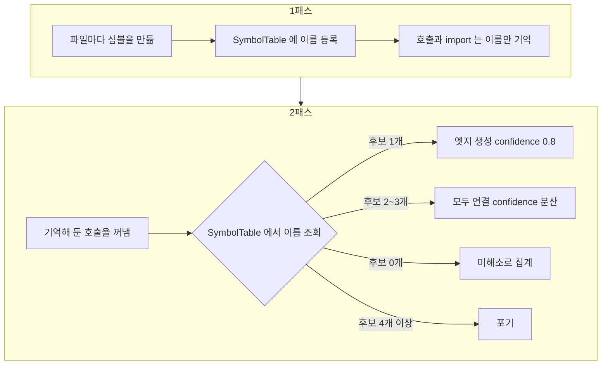

# 7. 참조를 해소한다

> **필요한 문법**: [6.2 `HashMap`과 `HashSet`](../rust/06-2-hashmap.md),
> [1.4 `.clone()`이 170번 나오는 이유](../rust/01-4-clone.md)

## 무엇을 하는 코드인가

앞 장까지 노드를 만들었습니다. 이제 노드 사이를 잇습니다.

`OrderService.java`에 `articleRepository.save(article)`이라는 호출이
있다고 합시다. 여기서 `save`가 **어느 심볼**을 가리키는지 알아내야
`CALLS` 엣지를 만들 수 있습니다.

## 그림



## 왜 두 번 처리하는가

이것이 이 장의 핵심입니다.

`A.java`가 `B.java`의 함수를 부를 수 있습니다. 그런데 파일을 훑는 순서상
`A.java`를 먼저 처리한다면, 그 시점에 `B.java`의 심볼은 아직 만들어지지
않았습니다.

그래서 두 번 처리합니다.

1. **1패스**에서 모든 파일의 심볼을 만들고 이름을 표에 등록합니다.
2. **2패스**에서 기억해 둔 호출을 꺼내 표에서 찾습니다.

한 번에 하려면 순서를 정렬해야 하는데, 순환 참조가 있으면 그것도 불가능합니다.

## 한 줄씩

### 1패스에서 기억해 둡니다

```rust
struct PendingFile {
    repo: String,
    rel: String,
    lang: String,
    file_id: NodeId,
    facts: extract::FileFacts,
    symbol_spans: Vec<(Span, NodeId)>,
    fw: FrameworkFacts,
    api_call_ids: Vec<(NodeId, String, String, bool)>,
}
```

1패스에서 파일마다 이 구조체를 만들어 쌓아 둡니다. 2패스에서 꺼내 씁니다.

`symbol_spans`가 중요합니다. 심볼의 시작과 끝 줄을 기억해 두는데,
**호출이 어느 심볼 안에 있는지** 알아내는 데 씁니다.

### 이름을 표에 등록합니다

```rust
pub struct SymbolTable {
    by_name: HashMap<String, Vec<NodeId>>,
    kinds: HashMap<String, String>,
    by_path: HashMap<String, NodeId>,
    implementors: HashMap<String, Vec<String>>,
}

pub fn insert_symbol(&mut self, name: &str, id: NodeId, kind: &str) {
    self.kinds.insert(id.0.clone(), kind.to_string());
    self.by_name.entry(name.to_string()).or_default().push(id);
}
```

`HashMap<String, Vec<NodeId>>`입니다. 값이 `Vec`인 이유는 **같은 이름이
여러 곳에 정의될 수 있기 때문입니다.** `save`라는 메서드가 서비스마다
있습니다.

`entry(...).or_default().push(id)`는 [6.2장](../rust/06-2-hashmap.md)에서
다룬 방식입니다. 처음 나온 이름이면 빈 목록을 만들고, 이미 있으면 거기에
덧붙입니다.

### 호출을 해소합니다

```rust
{{#include ../../../crates/nunchi-core/src/resolve.rs:resolve_call}}
```

후보 수에 따라 네 갈래로 나뉩니다.

**후보가 하나면** 신뢰도 0.8로 연결합니다. 1.0을 주지 않은 데에 이유가
있습니다. **이름이 같다는 사실은 타입을 해소한 것과 다릅니다.** 우연히 같은
이름일 수 있습니다. 정확한 해소는 컴파일러 수준의 분석이 필요하며, 그것은
SCIP 정밀 경로에서 할 일입니다.

**후보가 두셋이면** 모두 연결하되 신뢰도를 나눕니다. 어느 쪽인지 모르지만
그중 하나인 것은 맞기 때문입니다.

**후보가 넷 이상이면 포기합니다.**

```rust
const MAX_CANDIDATES: usize = 3;
```

`get`이나 `build` 같은 흔한 이름은 정의가 수십 개입니다. 전부 연결하면
그래프가 잡음으로 덮입니다. 연결하지 않는 편이 낫습니다.

**후보가 없으면** 미해소로 셉니다. 대개 외부 라이브러리 호출입니다.

### 미해소 이름을 기록합니다

```rust
0 => {
    stats.unresolved += 1;
    tally.record(callee);
    Vec::new()
}
```

미해소 호출의 이름을 세어 둡니다. 이것이 진단에 결정적입니다.

`nunchi doctor`가 상위 목록을 보여 줍니다.

```
미해소 호출 상위
  assertThat    79      AssertJ 이므로 정상입니다
  save          45      JPA 리포지터리라서 본문이 없습니다
  builder       39      Lombok 이 생성하는 코드입니다
```

**연결률 숫자 하나로는 판단할 수 없습니다.** 분모에 외부 라이브러리 호출이
그대로 들어가므로 낮은 것이 정상입니다. 목록에 나타나는 이름이 외부 API면
정상이고, 우리 코드에 있어야 할 이름이면 추출기에 결함이 있다는 뜻입니다.

이 구분을 처음에는 하지 못했습니다. "심볼 해소율 95% 목표"라는 지표를
만들었는데, 분모에 표준 라이브러리 호출이 들어가므로 **어떤 코드베이스에서도
도달할 수 없는 값**이었습니다. 도달할 수 없는 목표를 제시하는 지표는 진단에
해롭습니다. 그래서 이름을 "호출 연결률"로 바꾸고 판단 근거인 목록을 함께
내도록 고쳤습니다.

### 인터페이스를 구현으로 잇습니다

```rust
pub fn resolve_injection(&self, type_name: &str) -> Vec<NodeId> {
    let mut out: Vec<NodeId> = self.candidates(type_name).to_vec();
    if let Some(impls) = self.implementors.get(type_name) {
        for name in impls {
            out.extend(self.candidates(name).iter().cloned());
        }
    }
    out.sort();
    out.dedup();
    out
}
```

Spring에서 `@Autowired OrderService`라고 쓰면 인터페이스를 주입받습니다.
실제로 들어오는 것은 `OrderServiceImpl`입니다.

`implementors`에 상속 관계를 기억해 두었다가, 주입을 해소할 때 구현체까지
함께 후보로 냅니다. 인터페이스 자체도 남겨 둡니다. 구현이 여러 개일 때
인터페이스가 공통 진입점 역할을 하기 때문입니다.

`sort()` 다음에 `dedup()`을 부르는 이유가 있습니다. `dedup`은 **이웃한**
중복만 없애므로 정렬이 먼저 필요합니다.

### 호출이 어느 심볼에 속하는지 찾습니다

```rust
fn enclosing_symbol(spans: &[(Span, NodeId)], line: u32) -> Option<NodeId> {
    spans
        .iter()
        .filter(|(s, _)| s.start_line <= line && line <= s.end_line)
        .min_by_key(|(s, _)| s.end_line - s.start_line)
        .map(|(_, id)| id.clone())
}
```

이터레이터 체인입니다([4.3장](../rust/04-3-chains.md)).

1. `filter`로 그 줄을 포함하는 심볼만 남깁니다.
2. `min_by_key`로 **가장 좁은** 것을 고릅니다.
3. `map`으로 ID만 꺼냅니다.

가장 좁은 것을 고르는 이유가 있습니다. 클래스 안에 메서드가 있으면 둘 다
그 줄을 포함합니다. 우리가 원하는 것은 메서드입니다.

### 테스트 연결에서 겪은 문제

```rust
if is_test_path(&file.rel) {
    // ① 이름 기반: OrderServiceTest → OrderService
    for sym in &file.facts.symbols {
        let src = NodeId::symbol(&file.repo, &file.rel, &sym.name);
        for dst in table.subject_of_test(&sym.name) {
            // confidence 0.9
        }
    }

    // ② 호출 기반: 메서드·함수·클래스만
    for call in &file.facts.calls {
        for dst in table.candidates(&call.callee) {
            if table.is_test_symbol(dst) || !table.is_callable_unit(dst) {
                continue;
            }
            // confidence 0.6
        }
    }
}
```

처음에는 호출 기반만 썼습니다. 628건이 만들어졌는데 대부분이 잡음이었습니다.

```
setUp ──tests──▶ body
setUp ──tests──▶ title
setUp ──tests──▶ description
```

테스트 준비 코드가 Lombok 빌더로 DTO를 만들면서 필드 접근자를 부른 것입니다.
검증 대상이 아니라 그냥 필드입니다.

두 가지로 고쳤습니다. 이름 기반 판정을 주 경로로 삼고(`OrderServiceTest`에서
`OrderService`를 찾습니다), 호출 기반은 메서드와 함수와 클래스로 제한했습니다.
필드와 프로퍼티는 제외합니다.

628건에서 156건으로 줄었고 남은 것은 전부 의미가 있었습니다.

**많은 것이 좋은 것이 아닙니다.** 엣지 수가 늘면 그래프가 좋아 보이지만,
잡음이 섞이면 랭킹이 나빠집니다.

### 교차 저장소를 잇습니다

```rust
let mut route_index: HashMap<(String, String), NodeId> = HashMap::new();
for file in &pending {
    for r in &file.fw.routes {
        route_index.insert(
            (r.method.clone(), r.path.clone()),
            route_id(&r.method, &r.path),
        );
    }
}

for file in &pending {
    for (call_id, method, path, dynamic) in &file.api_call_ids {
        if *dynamic {
            continue;
        }
        let hit = route_index
            .get(&(method.clone(), path.clone()))
            .map(|id| (id.clone(), 0.9))
            .or_else(|| {
                route_index
                    .get(&("ANY".to_string(), path.clone()))
                    .map(|id| (id.clone(), 0.6))
            });
        // ...
    }
}
```

이것이 이 프로젝트의 존재 이유입니다.

키가 `(메서드, 경로)` 튜플입니다. 앞 장에서 경로를 정규화해 두었으므로
`/api/orders/{}`끼리 정확히 맞아떨어집니다.

라우트 ID에 저장소 이름이 들어가지 않는 것이 핵심입니다.

```rust
fn route_id(method: &str, path: &str) -> NodeId {
    NodeId(format!("route:{method} {path}"))
}
```

프런트엔드 저장소와 백엔드 저장소가 **같은 노드를 가리켜야** 연결이
성립합니다.

`.or_else(...)`는 정확히 맞는 라우트가 없을 때 메서드 무관 라우트를
찾습니다. Spring의 `@RequestMapping`은 메서드를 지정하지 않을 수 있기
때문입니다. 그때는 신뢰도를 0.6으로 낮춥니다.

`if *dynamic { continue; }`에서 앞의 `*`는 참조 해제입니다
([1.3장](../rust/01-3-borrow.md)). 반복에서 받은 것이 참조이므로 값을
꺼내야 합니다.

## 왜 이렇게 썼는가

### 왜 신뢰도를 붙이는가

모든 엣지에 신뢰도가 있습니다.

```rust
Edge::new(src, dst, EdgeKind::Calls, Provenance::Fast).with_confidence(0.8)
```

이름 기반 해소는 추정입니다. 나중에 SCIP 정밀 경로를 붙이면 정확한 해소가
가능해지는데, 그때 두 결과를 구분해야 합니다.

`Provenance`가 그 표시입니다. `Fast`는 tree-sitter 추정이고 `Precise`는
빌드 기반 해소입니다. 랭킹에서 정밀 엣지를 우선하게 만들 수 있습니다.

### 왜 `clone`이 이렇게 많은가

이 장의 코드에 `.clone()`이 자주 나옵니다. [1.4장](../rust/01-4-clone.md)에서
다룬 "정당한 복사"의 실제 사례입니다.

`Edge`가 `NodeId`를 소유해야 하는데, 한 심볼이 여러 엣지의 출발점이 되므로
매번 복사가 필요합니다. `NodeId`는 짧은 문자열 하나이므로 비용이 작습니다.

## 정리

파일 사이의 참조를 잇기 위해 두 번 처리합니다. 1패스에서 심볼을 전부 만들고
2패스에서 이름으로 찾습니다.

후보 수에 따라 신뢰도를 다르게 줍니다. 넷 이상이면 포기하는데, 흔한 이름이
그래프를 잡음으로 덮는 것을 막기 위해서입니다.

미해소 이름 목록이 진단의 핵심입니다. 연결률 숫자 하나로는 판단할 수
없습니다.

테스트 연결에서 628건이 156건으로 줄어든 사례처럼, 엣지가 많은 것이 좋은
것은 아닙니다.

다음 장에서는 이렇게 만든 그래프로 팩을 만드는 부분을 봅니다.
