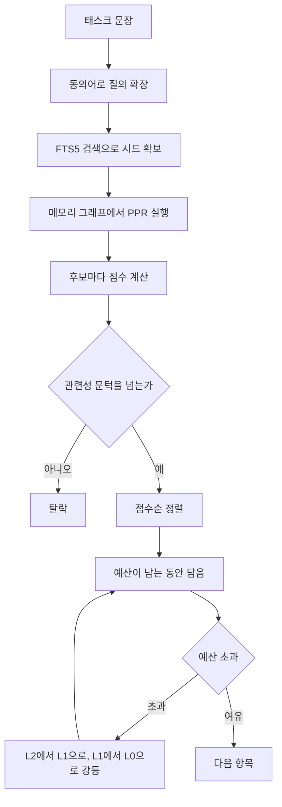

# 8. 팩을 만든다

> **필요한 문법**: [4.3 `map`, `filter`, `collect` 체인 읽기](../rust/04-3-chains.md),
> [3.3 `let ... else`와 `matches!`](../rust/03-3-let-else.md)

## 무엇을 하는 코드인가

여기가 이 프로그램의 목적지입니다. 지금까지 만든 그래프로 **토큰 절감**을
실제로 만들어 내는 부분입니다.

에이전트가 "댓글 삭제 로직 수정"이라고 물으면, 관련된 심볼 수십 개를
골라 토큰 예산 안에서 돌려줍니다. 돌려주는 것은 코드 덩어리가 아니라
**순위가 매겨진 좌표 목록**입니다.

## 그림



## 한 줄씩

### 다섯 단계

```rust
pub fn build_pack(
    store: &SqliteStore,
    graph: &MemGraph,
    task: &str,
    repo_roots: &HashMap<String, std::path::PathBuf>,
    opts: &PackOptions,
) -> Result<Pack> {
```

매개변수가 전부 빌림입니다. 이 함수는 아무것도 소유하지 않고 읽기만 합니다.

### 1단계: 시드를 찾습니다

```rust
let expanded = opts.synonyms.expand_query(task);
let hits = store.search(&expanded, opts.seed_limit)?;
let max_bm25 = hits.first().map(|h| h.score).unwrap_or(1.0).max(1e-6);

let mut bm25: HashMap<String, f32> = HashMap::new();
let mut seed_idx = Vec::new();
let mut seeds = Vec::new();
for h in &hits {
    bm25.insert(h.node.id.0.clone(), h.score / max_bm25);
    if let Some(i) = graph.index_of(&h.node.id) {
        seed_idx.push(i);
    }
    seeds.push(h.node.name.clone());
}
```

`expand_query`가 한국어 질의를 영어 식별자에 닿게 만듭니다. 설정에
`"댓글" = ["comment"]`가 있으면 두 단어를 모두 넣어 검색합니다.

`h.score / max_bm25`로 정규화합니다. BM25 점수는 절대값에 의미가 없고
상대 순위만 뜻하므로, 가장 높은 것을 1.0으로 맞춥니다. 그래야 다른 신호와
더할 수 있습니다.

`.max(1e-6)`은 0으로 나누는 것을 막습니다.

### 시드가 없으면 설명합니다

```rust
if hits.is_empty() {
    let non_ascii = task.chars().any(|c| !c.is_ascii());
    let hint = if non_ascii && opts.synonyms.terms.is_empty() {
        [
            format!("\"{task}\" 에 매칭되는 심볼이 없습니다."),
            "인덱스는 영어 식별자로 되어 있어 도메인 용어 사전이 필요합니다.".into(),
            // ...
        ].join("\n")
    } else {
        format!("\"{task}\" 에 매칭되는 항목이 없습니다. `nunchi find`로 확인해 보세요.")
    };
    return Ok(Pack { hint: Some(hint), /* ... */ });
}
```

한국어로만 질의했는데 동의어 사전이 없으면 아무것도 안 나옵니다. 그것이
정상 동작인데, 빈 결과만 돌려주면 사용자는 도구가 고장난 것으로 오해합니다.

그래서 원인과 해결책을 함께 알려 줍니다. 한국어 사용자가 가장 먼저 부딪히는
지점입니다.

### 2단계: 그래프로 넓힙니다

```rust
let ppr = graph.personalized_pagerank(&seed_idx, opts.damping, 25);
let central = graph.degree_centrality();
let max_ppr = ppr.iter().cloned().fold(1e-6f32, f32::max);

let cochange = cochange_scores(graph, &seed_idx);

let now = std::time::SystemTime::now()
    .duration_since(std::time::UNIX_EPOCH)
    .map(|d| d.as_secs() as i64)
    .unwrap_or(0);
```

개인화 페이지랭크가 시드에서 그래프를 따라 퍼집니다. [9장](09-graph.md)에서
이 함수를 봅니다.

`fold(1e-6f32, f32::max)`로 최댓값을 찾습니다. `f32`는 `NaN` 때문에 완전한
순서가 없어서 `max()`를 바로 쓸 수 없습니다.

### 3단계와 4단계: 점수를 매깁니다

```rust
for i in 0..graph.len() {
    let id = graph.id_at(i);
    let p = ppr[i] / max_ppr;
    let b = bm25.get(&id.0).copied().unwrap_or(0.0);

    if b <= 0.0 && p < opts.min_relevance {
        continue;
    }

    let Some((kind, mtime)) = store.node_kind_and_mtime(id)? else { continue };
    let prior = kind_prior(kind);
    let c = central[i];
    let cc = cochange.get(&i).copied().unwrap_or(0.0);
    let rc = recency_score(mtime, now);

    let score = (w.alpha_bm25 * b
        + w.beta_ppr * p
        + w.epsilon_central * c
        + w.delta_cochange * cc
        + w.gamma_recency * rc)
        * prior;
    // ...
}
```

다섯 신호를 가중치로 더하고 종류별 사전확률을 곱합니다.

`if b <= 0.0 && p < opts.min_relevance { continue; }`가 중요합니다. **어휘
일치가 있거나 그래프 근접도가 문턱을 넘어야 후보가 됩니다.**

이 문턱이 없었을 때 문제가 생겼습니다. `save`나 `getBySlug` 같은 연결이 많은
심볼이 어휘 일치도 0, 그래프 근접도 0인데도 중심성만으로 점수를 얻어 팩에
들어왔습니다. 실측에서 27개 항목 중 12개가 그런 경우였습니다.

**중심성과 최근성은 이미 관련이 있다고 판단된 노드들 사이에서 순위를
가르는 신호이며, 관련성 자체가 아닙니다.**

### 종류별 사전확률

```rust
fn kind_prior(kind: NodeKind) -> f32 {
    match kind {
        NodeKind::Symbol => 1.0,
        NodeKind::Route => 0.85,
        NodeKind::ApiCall => 0.7,
        NodeKind::File => 0.30,
        _ => 0.2,
    }
}
```

파일 점수를 낮게 준 이유가 있습니다. **파일은 심볼을 담는 그릇입니다.**
에이전트가 원하는 것은 "이 파일 어딘가"가 아니라 "이 함수의 이 줄"입니다.

이것을 넣기 전에는 파일 노드와 마이그레이션 SQL이 상위를 차지했습니다.

### 5단계: 예산에 맞춰 담습니다

```rust
{{#include ../../../crates/nunchi-core/src/pack.rs:budget_loop}}
```

`if *score < floor { break; }`가 예산에 대한 판단을 담고 있습니다.

**예산은 상한이지 목표가 아닙니다.** 처음에는 이 검사가 없어서 예산을 늘
끝까지 채웠습니다. 관련 파일이 3.4k 토큰뿐인 작업에 4k 예산을 다 쓰니
절감량이 -15%로 나왔습니다. 통째로 읽는 것보다 더 많이 쓴 것입니다.

`loop`로 감싼 부분이 강등입니다. 항목이 예산에 안 들어가면 상세도를 낮춰
다시 시도합니다. L2에서 L1으로, L1에서 L0으로 내려갑니다. L0에서도 안
들어가면 `None`이 되어 건너뜁니다.

### 상세도 세 단계

```rust
pub enum Tier {
    L0,   // 시그니처 한 줄과 좌표
    L1,   // 시그니처, 문서, 핵심 몇 줄
    L2,   // 전체 본문
}
```

```rust
let (doc, body) = match tier {
    Tier::L0 => (None, None),
    Tier::L1 => {
        let body = match (source, node.span) {
            (Verified::Fresh(text), Some(span)) => {
                Some(slice_lines(text, span.start_line, span.end_line, 15))
            }
            _ => None,
        };
        (node.doc.clone(), body)
    }
    Tier::L2 => { /* 400줄까지 */ }
};
```

L1은 15줄, L2는 400줄까지 담습니다. 이 강등이 60k를 4k로 만드는 실체
중 하나입니다.

### 낡은 인덱스를 걸러냅니다

```rust
enum Verified {
    Fresh(String),
    Unknown,
    Stale,
}

fn read_verified(node: &Node, roots: &HashMap<String, std::path::PathBuf>) -> Verified {
    let (Some(rel), Some(root)) = (node.path.as_deref(), roots.get(&node.repo)) else {
        return Verified::Unknown;
    };
    let abs = npath::to_extended_length(&root.join(rel));
    let Ok(bytes) = std::fs::read(&abs) else {
        return Verified::Stale;
    };
    if let Some(expected) = node.content_hash.as_deref() {
        if npath::content_hash(&bytes) != expected {
            return Verified::Stale;
        }
    }
    match String::from_utf8(bytes) {
        Ok(text) => Verified::Fresh(text),
        Err(_) => Verified::Unknown,
    }
}
```

인덱스는 반드시 낡습니다. 가장 흔한 원인은 **에이전트 자신이 방금 코드를
고쳤기 때문입니다.** 파일을 수정한 직후 워처가 반응하기 전에 다음 요청이
들어오는 상황은 일상적으로 발생합니다.

그래서 팩을 조립할 때 파일 해시를 대조합니다. 다르면 `stale` 목록에 넣고
본문 없이 반환합니다.

파일이 아예 없어도 `Stale`입니다. 처음에는 `Unknown`으로 두었는데,
그러면 존재하지 않는 좌표를 본문 없이 돌려주게 됩니다. **잘못된 좌표를
확신을 담아 주는 것보다 낡았다고 알리는 편이 언제나 낫습니다.**

### 토큰을 셉니다

```rust
pub fn estimate_tokens(text: &str) -> usize {
    (text.chars().count() as f32 / 3.6).ceil() as usize
}
```

Claude의 토크나이저는 공개되어 있지 않으므로 추정치입니다. 코드에서
경험적으로 문자 3.6개당 1토큰에 가깝습니다.

예산을 넘지 않는 것이 목적이므로 약간 보수적으로, 즉 많게 잡습니다.

## 왜 이렇게 썼는가

### 왜 가중치를 설정 파일에 두는가

```rust
pub struct RankWeights {
    pub alpha_bm25: f32,
    pub beta_ppr: f32,
    pub gamma_recency: f32,
    pub delta_cochange: f32,
    pub epsilon_central: f32,
}
```

랭킹 조정은 반복 실험입니다. 값을 바꿀 때마다 다시 빌드하면 실험이 느려집니다.

설정 파일에 두면 TUI에서 슬라이더로 조정하면서 결과를 바로 볼 수 있습니다.
저장하면 그 시점부터 에이전트도 같은 값을 씁니다.

여기서 실제로 결함이 하나 있었습니다. `gamma_recency`가 설정에도 있고 TUI
슬라이더도 있었는데 **점수 계산식에 항이 없었습니다.** 슬라이더를 움직여도
아무 일도 일어나지 않았습니다. 나중에 발견해서 고쳤습니다.

### 벤치가 결함을 잡아냈습니다

`bench.rs`가 이 절감을 측정합니다.

```rust
pub struct BenchTask {
    pub task: String,
    #[serde(default)]
    pub expect: Vec<String>,
}
```

`expect`에는 그 작업을 풀려면 반드시 봐야 하는 좌표를 적습니다. **토큰만
줄고 답을 놓치면 무의미하기 때문입니다.**

RealWorld 저장소로 잰 결과입니다.

```
task                          grounded ungrounded    절감  recall
댓글 삭제 로직 수정                 2934       9593    69%    100%
게시글 조회                       3971      14889    73%    100%
사용자 인증 로그인                  3960       3462   -14%    100%
평균                            3647       9613    53%    100%
```

"사용자 인증 로그인"이 -14%로 남아 있습니다. **이것은 결함이 아닙니다.**
그 저장소의 인증 코드가 작은 파일 몇 개에 모여 있어서 grep이 정확히
찾아냅니다. 팩에 담긴 항목은 모두 실제로 인증과 관련된 코드였습니다.

숫자가 좋아 보일 때까지 계속 조정하는 것은 위험합니다. 그래프가 이기지
못하는 경우를 드러내는 것도 벤치가 하는 일입니다.

`ungrounded` 값은 **대리 지표**입니다. 실제 에이전트 세션이 아니라
"질의어에 걸리는 파일을 통째로 읽었을 때"를 계산한 값입니다. 상대 비교에는
유효하지만 절대 절감률로 인용하면 안 됩니다.

## 정리

팩 만들기는 다섯 단계입니다. 시드를 찾고, 그래프로 넓히고, 점수를 매기고,
정렬하고, 예산에 맞춰 담습니다.

관련성 문턱이 없으면 연결이 많은 심볼이 중심성만으로 들어옵니다. 예산 하한이
없으면 관련 코드가 적은 작업에서 오히려 손해가 납니다. 둘 다 벤치가
잡아냈습니다.

낡은 인덱스는 `stale`로 표시합니다. 잘못된 좌표를 주는 것보다 낫습니다.

다음 장에서는 페이지랭크를 계산하는 부분을 봅니다.
