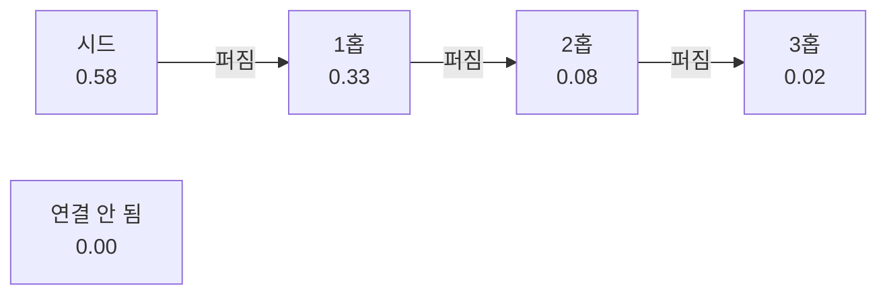

# 9. 메모리 그래프와 페이지랭크

> **필요한 문법**: [6.1 `Vec<T>`와 슬라이스](../rust/06-1-vec.md)

## 무엇을 하는 코드인가

앞 장에서 쓴 `personalized_pagerank`가 여기 있습니다.

질의가 지목한 심볼에서 출발해 그래프를 따라 퍼지면서, 각 노드가 얼마나
관련 있는지 점수를 매깁니다. 구글이 웹 페이지 순위를 매기던 방식과 같은
알고리즘인데, 출발점을 특정 노드로 고정한 형태입니다.

## 그림



시드에서 멀어질수록 점수가 줄어듭니다. 연결되지 않은 노드는 0입니다.

## 한 줄씩

### 그래프를 통째로 메모리에 올립니다

```rust
pub struct MemGraph {
    ids: Vec<NodeId>,
    index: HashMap<String, usize>,
    out: Vec<Vec<(usize, f32)>>,
    inc: Vec<Vec<(usize, f32)>>,
    kinds: Vec<Vec<(usize, EdgeKind)>>,
}
```

`ids`가 노드 목록이고, 나머지는 인접 리스트입니다.

**노드를 `NodeId` 대신 `usize` 번호로 다룹니다.** 문자열을 비교하는 것보다
숫자를 배열 인덱스로 쓰는 편이 훨씬 빠르기 때문입니다. `index`가 문자열에서
번호로 바꾸는 표입니다.

`out`은 나가는 엣지, `inc`는 들어오는 엣지입니다. 둘 다 갖는 이유는 뒤에서
설명합니다.

```rust
pub fn load(store: &SqliteStore) -> Result<Self> {
    let node_ids = store.all_node_ids()?;
    let mut index = HashMap::with_capacity(node_ids.len());
    for (i, id) in node_ids.iter().enumerate() {
        index.insert(id.0.clone(), i);
    }

    let n = node_ids.len();
    let mut graph = MemGraph {
        ids: node_ids,
        index,
        out: vec![Vec::new(); n],
        inc: vec![Vec::new(); n],
        kinds: vec![Vec::new(); n],
    };

    for (src, dst, kind, weight) in store.all_edges()? {
        let (Some(&s), Some(&d)) = (graph.index.get(&src), graph.index.get(&dst)) else {
            continue;
        };
        graph.out[s].push((d, weight));
        graph.inc[d].push((s, weight));
        // ...
    }
    Ok(graph)
}
```

`HashMap::with_capacity(n)`으로 크기를 미리 잡습니다. `HashMap`은 차면
전체를 다시 배치하므로, 개수를 아는 경우 미리 잡는 편이 빠릅니다.

`vec![Vec::new(); n]`은 빈 목록 `n`개를 만듭니다.

`let (Some(&s), Some(&d)) = ... else { continue; }`는 튜플 두 개를 한 번에
푸는 `let ... else`입니다([3.3장](../rust/03-3-let-else.md)). 양쪽 노드가
모두 있어야 엣지를 만듭니다. 정리 중이거나 한쪽이 지워진 엣지를 건너뜁니다.

`&s`에서 `&`는 참조를 해제하는 패턴입니다. `HashMap::get`이 `Option<&usize>`를
돌려주는데, `Some(&s)`로 받으면 `s`가 `usize` 값이 됩니다.

### 메모리를 얼마나 쓰는가

엣지 100만 개면 인접 리스트가 약 50MB입니다. 요즘 기준으로 부담이 없습니다.

이 사실이 [6장](06-store.md)에서 그래프 데이터베이스를 쓰지 않은 근거가
됩니다. **순회를 메모리에서 하면 저장 엔진의 순회 성능이 중요하지 않습니다.**

### 페이지랭크

```rust
{{#include ../../../crates/nunchi-core/src/graph.rs:ppr}}
```

풀어서 설명하겠습니다.

```rust
let seed_mass = 1.0 / seeds.len() as f32;
let mut restart = vec![0.0f32; n];
for &s in seeds {
    if s < n {
        restart[s] += seed_mass;
    }
}
rank.copy_from_slice(&restart);
```

시드가 세 개면 각각 1/3씩 점수를 갖고 시작합니다. `restart`는 나중에
"돌아갈 곳"으로 쓰입니다.

```rust
for _ in 0..iterations {
    next.iter_mut().for_each(|v| *v = 0.0);

    for i in 0..n {
        if rank[i] == 0.0 { continue; }

        let total: f32 = self.out[i].iter().map(|(_, w)| *w).sum::<f32>()
            + self.inc[i].iter().map(|(_, w)| *w).sum::<f32>();
        // ...
        let share = rank[i] * damping / total;
        for (j, w) in &self.out[i] {
            next[*j] += share * w;
        }
        for (j, w) in &self.inc[i] {
            next[*j] += share * w;
        }
    }

    for (j, r) in restart.iter().enumerate() {
        next[j] += (1.0 - damping) * r;
    }
    std::mem::swap(&mut rank, &mut next);
}
```

각 반복에서 이렇게 합니다.

1. 모든 노드가 자기 점수의 `damping` 배를 이웃에게 나눠 줍니다.
2. 나머지 `1 - damping` 배는 시드로 돌아갑니다.
3. 25번 반복하면 값이 안정됩니다.

`std::mem::swap`으로 두 배열을 맞바꿉니다. 매번 새 배열을 만들면 25번
할당이 일어나는데, 두 개를 번갈아 쓰면 할당이 없습니다.

`next.iter_mut().for_each(|v| *v = 0.0)`도 같은 이유입니다. 새로 만들지 않고
있는 것을 0으로 채웁니다.

### 왜 엣지를 무향으로 다루는가

`out`과 `inc`를 모두 따라가는 것이 보입니다. 방향을 무시한다는 뜻입니다.

이유가 있습니다. **어떤 함수를 호출하는 쪽도 호출당하는 쪽만큼 맥락으로서
중요하기 때문입니다.** `OrderService.save`를 고치려면 그것을 부르는
컨트롤러도 봐야 합니다.

### 감쇠 계수를 0.5로 정한 이유

```rust
pub const DEFAULT_DAMPING: f32 = 0.5;
```

일반적인 페이지랭크는 0.85를 씁니다. 여기서는 0.5입니다.

실측으로 정했습니다. 경로 `a → b → c`에서 `a`를 시드로 두고 계산했습니다.

| 감쇠 계수 | 시드 | 1홉 | 2홉 |
|---|---|---|---|
| 0.85 | 0.35 | **0.46** | 0.20 |
| 0.70 | 0.44 | 0.41 | 0.14 |
| 0.50 | **0.58** | 0.33 | 0.08 |
| 0.30 | 0.73 | 0.23 | 0.03 |

0.85에서는 1홉 이웃이 시드를 **추월합니다.** 무향으로 다루므로 연결이 많은
노드에 점수가 쏠리기 때문입니다.

컨텍스트 랭킹에서는 질의가 직접 지목한 노드가 가장 높아야 합니다. 그래서
돌아가는 확률을 크게 잡았습니다. 0.5에서 시드 0.58, 1홉 0.33, 2홉 0.08로
거리에 따라 깔끔하게 줄어듭니다.

이 표를 만들기 위해 임시로 시험용 테스트를 하나 썼다가, 값을 정한 뒤
지웠습니다.

### 이 계산을 미리 해 둘 수 없는 이유

페이지랭크는 **시드에 의존합니다.** 질의마다 시드가 다르므로 미리 계산해
둘 수 없습니다.

이 사실이 인덱싱 설계의 근거가 됩니다. 갱신 비용을 세 계층으로 나눌 때,
페이지랭크 같은 전역 계산을 쓰기 경로에서 완전히 뺄 수 있었던 이유가
"어차피 미리 계산할 수 없다"는 점이었습니다.

### 중심성

```rust
pub fn degree_centrality(&self) -> Vec<f32> {
    let max = self.out.iter().zip(&self.inc)
        .map(|(o, i)| (o.len() + i.len()) as f32)
        .fold(1.0f32, f32::max);
    self.out.iter().zip(&self.inc)
        .map(|(o, i)| (o.len() + i.len()) as f32 / max)
        .collect()
}
```

연결 수를 세어 가장 많은 노드를 1.0으로 맞춥니다.

`zip`은 두 목록을 짝지어 함께 훑습니다([4.3장](../rust/04-3-chains.md)).

이 값은 **동점을 가르는 용도**입니다. [8장](08-pack.md)에서 관련성 임계값을
둔 이유가 이것입니다. 중심성만으로는 팩에 들어올 자격이 생기지 않습니다.

### 종류별 이웃

```rust
pub fn neighbors_of_kind(&self, node: usize, kind: EdgeKind) -> Vec<usize> {
    self.kinds[node]
        .iter()
        .filter(|(_, k)| *k == kind)
        .map(|(d, _)| *d)
        .collect()
}
```

`CALLS_API`나 `CO_CHANGED_WITH` 같은 특정 엣지만 따라갈 때 씁니다.
동시 변경 점수를 계산하거나 교차 저장소 연결을 찾을 때 쓰입니다.

## 왜 이렇게 썼는가

### 왜 라이브러리를 쓰지 않았는가

Rust에 그래프 라이브러리가 있습니다. 쓰지 않은 이유는 필요한 것이
페이지랭크 하나뿐이고, 그 코드가 40줄이기 때문입니다.

라이브러리를 넣으면 데이터를 그쪽 형식으로 바꿔야 하고, 그 변환 비용이
계산 비용보다 클 수 있습니다.

### 왜 매번 그래프를 다시 만드는가

질의할 때마다 `MemGraph::load`를 부릅니다. 데이터베이스에서 전부 읽어
인접 리스트를 만듭니다.

노드 700개 규모에서는 순식간이라 문제가 되지 않습니다. 노드가 수십만 개로
늘면 캐시해 두어야 합니다. MCP 서버가 오래 살아 있으므로 그때 캐시를 두기에
적합한 위치입니다.

지금 하지 않은 이유는 **필요해지기 전에 복잡도를 늘리지 않기 위해서입니다.**
캐시를 두면 인덱스가 바뀌었을 때 무효화하는 문제가 생깁니다.

## 정리

그래프를 통째로 메모리에 올려 페이지랭크를 계산합니다. 엣지 100만 개가
약 50MB이므로 부담이 없습니다.

엣지를 무향으로 다루고 감쇠 계수를 0.5로 둡니다. 0.85에서는 연결이 많은
이웃이 시드를 추월하기 때문이며, 실측으로 정했습니다.

페이지랭크는 시드에 의존하므로 미리 계산할 수 없습니다. 이 사실이 인덱싱
설계의 근거가 됩니다.

다음 장에서는 파일 변경을 감시하는 부분을 봅니다.
