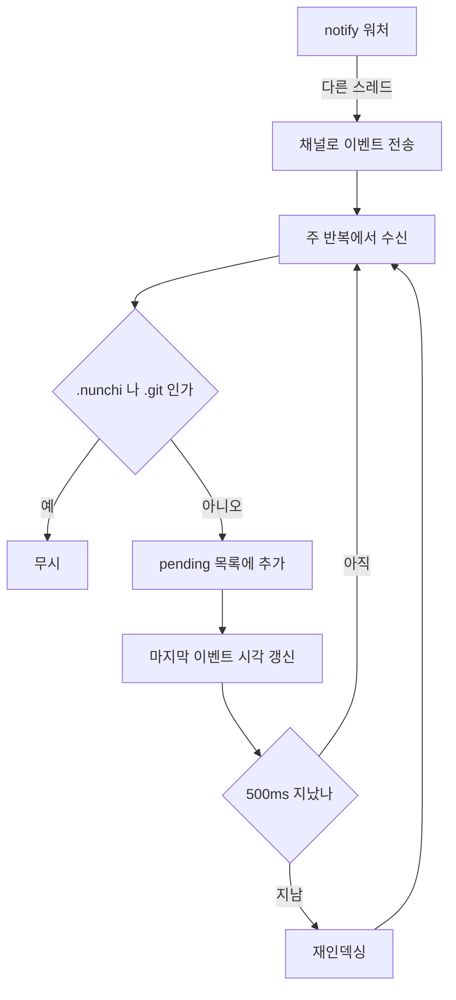

# 10. 파일 워처

> **필요한 문법**: [8.2 채널 `mpsc`로 워처 만들기](../rust/08-2-channels.md)

## 무엇을 하는 코드인가

`nunchi index --watch`는 데몬으로 실행되면서 파일 변경을 감시합니다. 코드를
고치면 인덱스가 함께 갱신됩니다.

간단해 보이지만 한 가지가 어렵습니다. **`git checkout`이 파일 수천 개를
한꺼번에 바꿉니다.** 그것을 개별 이벤트로 처리하면 감당하지 못합니다.

## 그림



## 한 줄씩

### 워처를 만듭니다

```rust
let (tx, rx) = mpsc::channel::<Event>();
let mut watcher = notify::recommended_watcher(move |res: notify::Result<Event>| {
    if let Ok(event) = res {
        let _ = tx.send(event);
    }
})
.context("파일 워처를 만들 수 없습니다")?;
```

`notify` 크레이트가 운영체제마다 다른 감시 방식을 감싸 줍니다. macOS는
FSEvents, Windows는 `ReadDirectoryChangesW`, Linux는 inotify를 씁니다.

콜백은 **다른 스레드에서** 호출됩니다. 그래서 채널로 주 스레드에 보냅니다
([8.2장](../rust/08-2-channels.md)).

`move`가 붙은 이유는 `tx`의 소유권을 콜백으로 넘겨야 하기 때문입니다.
콜백이 워처와 함께 오래 살아 있으므로 빌려서는 안 됩니다.

`let _ = tx.send(event);`에서 결과를 무시합니다. 주 반복이 이미 끝났으면
전송이 실패하는데, 그때는 종료 중이므로 신경 쓸 필요가 없습니다.

### 저장소를 등록합니다

```rust
for repo in &config.solution.repos {
    let root = repo.canonicalize()
        .with_context(|| format!("저장소 경로를 찾을 수 없습니다: {}", repo.display()))?;
    watcher.watch(&root, RecursiveMode::Recursive)
        .with_context(|| format!("감시 실패: {}", root.display()))?;
    println!("감시 중  {}", root.display());
}
```

`canonicalize`는 심볼릭 링크를 풀고 절대 경로로 만듭니다. 상대 경로로
감시하면 나중에 경로를 비교할 때 어긋납니다.

### 이벤트를 모읍니다

```rust
const DEBOUNCE: Duration = Duration::from_millis(500);

let mut pending: HashSet<PathBuf> = HashSet::new();
let mut last_event: Option<Instant> = None;

loop {
    match rx.recv_timeout(Duration::from_millis(200)) {
        Ok(event) => {
            if !matches!(
                event.kind,
                EventKind::Create(_) | EventKind::Modify(_) | EventKind::Remove(_)
            ) {
                continue;
            }
            for p in event.paths {
                if p.components().any(|c| c.as_os_str() == ".nunchi" || c.as_os_str() == ".git") {
                    continue;
                }
                pending.insert(p);
            }
            if !pending.is_empty() {
                last_event = Some(Instant::now());
            }
        }
        Err(mpsc::RecvTimeoutError::Timeout) => {}
        Err(mpsc::RecvTimeoutError::Disconnected) => break,
    }
    // ...
}
```

`recv_timeout`을 쓰는 이유가 있습니다. 그냥 `recv()`를 부르면 이벤트가 올
때까지 영원히 멈춥니다. 그러면 debounce 시간이 지났는지 확인할 수 없습니다.
200밀리초마다 깨어나서 확인합니다.

`matches!`로 관심 있는 이벤트만 거릅니다([3.3장](../rust/03-3-let-else.md)).
파일 접근 시각 변경 같은 것은 무시합니다.

`.nunchi`와 `.git`을 빼는 것이 중요합니다. **인덱스 자신의 변경에 반응하면
무한 반복이 됩니다.** 재인덱싱이 `graph.db`를 쓰고, 그것이 이벤트를 만들고,
다시 재인덱싱하게 됩니다.

`HashSet`을 쓴 이유는 같은 파일이 여러 번 바뀌어도 한 번만 세기
위해서입니다.

### debounce가 끝나면 처리합니다

```rust
let ready = last_event.is_some_and(|t| t.elapsed() >= DEBOUNCE);
if !ready || pending.is_empty() {
    continue;
}

let count = pending.len();
pending.clear();
last_event = None;

let started = Instant::now();
match reindex(&config, &db_path, &cache_path) {
    Ok(stats) => println!(
        "변경 {count}건 → 재인덱싱 {:.2}s · 캐시 적중 {}/{} ({:.0}%)",
        started.elapsed().as_secs_f64(),
        stats.cache_hits,
        stats.cache_hits + stats.cache_misses,
        // ...
    ),
    Err(e) => eprintln!("재인덱싱 실패: {e}"),
}
```

`is_some_and`는 "값이 있고 그 값이 조건을 만족하는가"를 한 번에 확인합니다
([2.1장](../rust/02-1-option.md)).

**마지막 이벤트로부터 500밀리초가 지나야** 처리합니다. 그 사이에 새 이벤트가
오면 `last_event`가 갱신되어 다시 기다립니다.

이것이 브랜치 전환을 견디는 방법입니다. `git checkout`이 파일 1,200개를
바꾸면 이벤트가 1,200번 오는데, 전부 `pending`에 모였다가 한 번에
처리됩니다.

재인덱싱이 실패해도 `eprintln!`으로 알리기만 하고 반복을 계속합니다.
데몬이 오류 하나로 종료되면 안 되기 때문입니다.

### 재인덱싱

```rust
fn reindex(config: &Config, db_path: &PathBuf, cache_path: &PathBuf) -> Result<index::IndexStats> {
    let mut store = SqliteStore::open(db_path)?;
    let mut cache = ExtractCache::open(cache_path)?;
    store.clear()?;
    let stats = index::index_all_with_cache(config, &mut store, Some(&mut cache))?;
    cache.evict(2 * 1024 * 1024 * 1024)?;
    Ok(stats)
}
```

**전체를 다시 인덱싱합니다.** 바뀐 파일만 처리하지 않습니다.

비효율로 보이지만 내용 해시 기반 캐시 덕분에 비용이 낮습니다. 바뀌지 않은
파일은 해시가 같으므로 파싱하지 않고 캐시에서 꺼냅니다.

실측입니다.

```
1회차 (캐시 비어 있음)   0.65초   적중 0/19
2회차 (내용 동일)        0.20초   적중 19/19 (100%)
```

`cache.evict(2GB)`로 캐시가 무한정 자라지 않게 합니다. 오래 쓰지 않은
항목부터 지웁니다.

## 왜 이렇게 썼는가

### 왜 파일 단위 갱신을 하지 않는가

바뀐 파일만 다시 처리하면 더 빠를 것입니다. 하지 않은 이유가 있습니다.

**2패스 구조 때문입니다.** [7장](07-resolve.md)에서 본 것처럼, 참조 해소는
모든 심볼이 있어야 가능합니다. 파일 하나를 고치면 그 파일을 참조하던 다른
파일의 엣지도 다시 계산해야 합니다.

그것을 정확히 하려면 역인덱스를 관리해야 하고, 그 복잡도가 지금 얻는 것보다
큽니다. 캐시로 비용이 이미 낮아졌기 때문입니다.

노트북에서 저장소 두 개를 재인덱싱하는 데 0.2초가 걸립니다. 더 큰 저장소에서 문제가 되면 그때
넣으면 됩니다.

### Windows에서 확인해야 할 것

이 코드는 macOS에서만 실측했습니다. Windows의
`ReadDirectoryChangesW`는 대량 변경을 처리하는 방식이 다릅니다.

브랜치를 전환해 보고 이벤트가 몰릴 때 debounce가 제대로 동작하는지
확인해야 합니다. 500밀리초가 부족하면 늘려야 할 수도 있습니다.

## 정리

워처는 다른 스레드에서 오는 이벤트를 채널로 받습니다. 500밀리초 debounce로
모아서 한 번에 처리하므로 브랜치 전환의 이벤트 폭주를 견딥니다.

`.nunchi`와 `.git` 변경을 무시하지 않으면 무한 반복이 됩니다.

재인덱싱은 전체를 다시 하지만 내용 해시 기반 캐시 덕분에 0.2초입니다.

다음 장에서 마지막으로 MCP 서버와 TUI를 봅니다.
