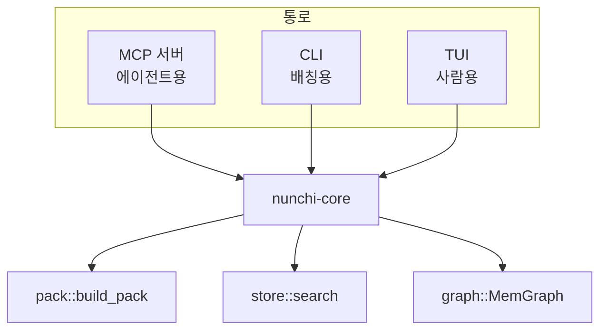

# 11. MCP 서버와 TUI

> **필요한 문법**: [8.3 `Arc`와 `async`](../rust/08-3-async.md),
> [5.2 트레이트](../rust/05-2-traits.md)

## 무엇을 하는 코드인가

지금까지 만든 그래프를 밖으로 내보내는 두 통로입니다.

**MCP 서버**는 에이전트가 씁니다. 표준 입출력으로 JSON-RPC를 주고받습니다.

**TUI**는 사람이 씁니다. 그래프를 눈으로 탐색하고 랭킹 가중치를 조정합니다.

둘 다 `nunchi-core`의 같은 함수를 부릅니다. 통로만 다르고 하는 일은
같습니다. 그래서 TUI에 보이는 것과 에이전트가 받는 것이 정확히 일치합니다.

## 그림



## MCP 서버

### 도구를 다섯 개만 노출합니다

```rust
async fn list_tools(
    &self,
    _params: Option<PaginatedRequestParams>,
    _context: RequestContext<RoleServer>,
) -> Result<ListToolsResult, McpError> {
    let tools = vec![
        tool("nunchi_pack", "태스크 설명으로 컨텍스트 팩을 만든다. ...", schema(...)),
        tool("nunchi_find", "심볼·파일·라우트를 이름으로 찾아 좌표를 반환한다.", schema(...)),
        tool("nunchi_neighbors", "노드의 이웃을 반환한다.", schema(...)),
        tool("nunchi_impact", "이 심볼을 고치면 무엇이 깨지는지.", schema(...)),
        tool("nunchi_doctor", "인덱스 상태.", schema(...)),
    ];
    Ok(ListToolsResult { tools, ..Default::default() })
}
```

도구 개수를 다섯으로 제한한 것이 의도된 설계입니다.

**MCP 도구 스키마는 대화가 시작되는 시점부터 계속 비용을 발생시킵니다.**
세션이 시작되기도 전에 도구 정의가 컨텍스트를 차지합니다. 도구가 스무 개면
그만큼 매 요청에 실려 갑니다.

여러 질의를 묶어야 할 때는 MCP 대신 CLI를 씁니다. CLI에는 스키마 비용이
없고 Bash 한 번으로 여러 명령을 이어 실행할 수 있습니다.

```bash
nunchi pack "$TASK" --json && nunchi find "OrderService" --json
```

### 트레이트를 구현합니다

```rust
impl ServerHandler for NunchiServer {
    fn get_info(&self) -> ServerInfo { /* ... */ }
    async fn list_tools(&self, ...) -> Result<ListToolsResult, McpError> { /* ... */ }
    async fn call_tool(&self, ...) -> Result<CallToolResponse, McpError> { /* ... */ }
}
```

`rmcp` 크레이트가 정한 트레이트를 구현합니다
([5.2장](../rust/05-2-traits.md)). 프로토콜 처리는 크레이트가 하고, 우리는
도구 목록과 실행만 채웁니다.

`async fn`이 여기 두 개 있습니다. 이 코드베이스 전체에서 `async`가 나오는
곳은 이 파일뿐입니다([8.3장](../rust/08-3-async.md)).

### 도구를 실행합니다

```rust
async fn call_tool(
    &self,
    request: CallToolRequestParams,
    _context: RequestContext<RoleServer>,
) -> Result<CallToolResponse, McpError> {
    let store = self.store()?;
    let err = |e: anyhow::Error| McpError::internal_error(e.to_string(), None);

    match request.name.as_ref() {
        "nunchi_pack" => {
            let task = arg_str(&request, "task")?;
            let budget = arg_usize(&request, "budget", 4000);
            let graph = MemGraph::load(&store).map_err(err)?;
            let opts = pack::PackOptions {
                budget,
                weights: self.config.rank,
                synonyms: self.config.semantic.clone(),
                ..Default::default()
            };
            let result = pack::build_pack(&store, &graph, &task, &self.roots, &opts).map_err(err)?;
            Ok(ok_json(serde_json::to_value(result).unwrap_or_default()))
        }
        // ...
        other => Err(McpError::invalid_params(format!("알 수 없는 툴: {other}"), None)),
    }
}
```

`let err = |e: anyhow::Error| McpError::internal_error(...)`는 클로저를
변수에 담은 것입니다([4.1장](../rust/04-1-closures.md)). 오류 변환을 여러 번
써야 하므로 한 번 만들어 두고 재사용합니다.

`.map_err(err)?`는 `anyhow` 오류를 MCP 오류로 바꾼 뒤 `?`로 넘깁니다
([2.3장](../rust/02-3-question-mark.md)). 두 오류 타입이 다르므로 자동
변환이 되지 않아 직접 바꿔야 합니다.

`match`가 도구 이름으로 갈라집니다. 마지막 `other =>`가 없으면 컴파일되지
않습니다. 문자열은 경우의 수가 무한하므로 컴파일러가 빠짐없음을 보장할 수
없기 때문입니다([3.1장](../rust/03-1-match.md)).

### 표준 출력을 지킵니다

```rust
pub fn run(config: Config, db_path: PathBuf) -> Result<()> {
    let runtime = tokio::runtime::Builder::new_multi_thread().enable_all().build()?;
    runtime.block_on(async move {
        let service = NunchiServer::new(config, db_path)
            .serve(rmcp::transport::io::stdio())
            .await?;
        service.waiting().await?;
        Ok::<_, anyhow::Error>(())
    })
}
```

`stdio()`는 표준 입출력을 통로로 씁니다. **표준 출력이 JSON-RPC 전용입니다.**

[1장](01-index-command.md)에서 로그를 표준 오류로 보낸 이유가 이것입니다.
개발 중에 실제로 겪었습니다. `initialize`는 성공하는데 `tools/list`에서
응답을 파싱하지 못했습니다. 로그 한 줄이 JSON 사이에 끼어 있었습니다.

`block_on`은 비동기 코드를 동기 함수 안에서 실행합니다. `main`이 동기
함수이므로 어딘가에서 다리를 놓아야 합니다.

`Ok::<_, anyhow::Error>(())`에서 타입을 직접 적은 이유는 컴파일러가 오류
타입을 추론하지 못하기 때문입니다. `_`는 성공 타입을 추론하라는 뜻입니다.

## TUI

### 화면 다섯 개

```rust
enum Screen {
    Explore,   // 탐색
    Impact,    // 영향 범위
    Index,     // 인덱스 상태
    Pack,      // 팩 미리보기
    Bench,     // 지표
}
```

화면마다 서로 다른 고장을 찾아냅니다.

| 화면 | 찾아내는 문제 |
|---|---|
| 탐색 | 추출 오류입니다. 호출 엣지가 아예 없는 경우를 발견합니다 |
| 영향 범위 | 영향 분석이 누락된 부분을 발견합니다 |
| 인덱스 | 언어 커버리지입니다. 특정 언어가 전혀 파싱되지 않는 상황을 발견합니다 |
| 팩 미리보기 | 랭킹 문제입니다 |
| 지표 | 교차 저장소 연결이 나빠졌는지 확인합니다 |

에이전트가 헛다리를 짚었을 때 원인이 **추출 실패인지 랭킹 오류인지 인덱스
노후인지** 사람이 갈라낼 수단이 필요합니다. 그것이 TUI의 존재 이유입니다.

### 상태를 한곳에 모읍니다

```rust
struct App {
    config: Config,
    config_path: PathBuf,
    db_path: PathBuf,
    store: SqliteStore,
    graph: MemGraph,
    roots: HashMap<String, PathBuf>,
    metrics: serde_json::Value,

    screen: Screen,
    input: String,
    editing: bool,
    status: String,

    results: Vec<ResultRow>,
    list_state: ListState,
    pack: Option<pack::Pack>,
    budget: usize,
    weight_cursor: usize,
    dirty_weights: bool,
}
```

TUI는 상태를 계속 바꿉니다. 그 상태를 한 구조체에 모으고 `&mut App`으로
넘깁니다.

이렇게 하면 소유권 문제가 단순해집니다. 상태가 여기저기 흩어져 있으면 여러
곳에서 빌리려다 [1.3장](../rust/01-3-borrow.md)의 규칙에 걸립니다.

### 이벤트 반복

```rust
fn event_loop(
    terminal: &mut Terminal<CrosstermBackend<std::io::Stdout>>,
    app: &mut App,
) -> Result<()> {
    loop {
        terminal.draw(|f| draw(f, app))?;

        if !event::poll(Duration::from_millis(200))? {
            continue;
        }
        let Event::Key(key) = event::read()? else { continue };
        if key.kind != KeyEventKind::Press {
            continue;
        }

        match key.code {
            KeyCode::Char('q') if !app.editing => return Ok(()),
            KeyCode::Tab => { /* 화면 전환 */ }
            KeyCode::Left if app.screen == Screen::Pack => {
                app.adjust_weight(app.weight_cursor, -0.05);
                app.dirty_weights = true;
                app.rebuild_pack();
            }
            // ...
        }
    }
}
```

`event::poll`로 200밀리초를 기다립니다. 입력이 없으면 다시 그립니다.
`event::read()`를 바로 부르면 입력이 올 때까지 멈추므로 화면을 갱신할 수
없습니다.

`match key.code`에 조건이 붙은 팔이 있습니다.

```rust
KeyCode::Char('q') if !app.editing => return Ok(()),
```

`if !app.editing`이 **가드**입니다. 입력 모드에서 `q`를 누르면 종료가 아니라
글자를 넣어야 하기 때문입니다.

### 가중치를 조정하면 즉시 다시 계산합니다

```rust
KeyCode::Left if app.screen == Screen::Pack => {
    app.adjust_weight(app.weight_cursor, -0.05);
    app.dirty_weights = true;
    app.rebuild_pack();
}
```

화살표를 누르면 가중치가 바뀌고 팩이 다시 만들어집니다. 결과가 눈앞에서
바뀝니다.

**랭킹 조정이 감각에 의존하는 작업에서 관찰에 근거하는 작업으로 바뀝니다.**
가중치를 바꿨을 때 어떤 심볼이 올라오고 내려가는지 직접 봅니다.

### 저장은 공용 파일로 갑니다

```rust
fn save_weights(&mut self) {
    let dir = self.config_path.parent().unwrap_or(std::path::Path::new(".")).to_path_buf();
    match self.config.save_shared(&dir) {
        Ok(path) => {
            self.dirty_weights = false;
            self.status = format!("{} 에 저장 — 커밋하면 다른 머신·에이전트도 이 값을 씁니다", path.display());
        }
        Err(e) => self.status = format!("저장 실패: {e}"),
    }
}
```

[2장](02-config.md)에서 본 `nunchi.shared.toml`로 저장합니다. 장비별 파일에
넣으면 경로가 섞여 `.gitignore` 대상이 되고, 그러면 다른 장비와 공유할 수
없습니다.

### 소유권 때문에 고친 부분

처음에는 이렇게 썼습니다.

```rust
fn weights_mut(&mut self) -> [&mut f32; 5] {
    let w = &mut self.config.rank;
    [&mut w.alpha_bm25, &mut w.beta_ppr, /* ... */]
}
```

컴파일되지 않았습니다. 배열에서 `&mut` 하나를 꺼내려면 배열 전체를 옮겨야
하는데, `&mut`는 복사할 수 없기 때문입니다.

이렇게 고쳤습니다.

```rust
fn adjust_weight(&mut self, index: usize, delta: f32) {
    let w = &mut self.config.rank;
    let slot = match index {
        0 => &mut w.alpha_bm25,
        1 => &mut w.beta_ppr,
        2 => &mut w.gamma_recency,
        3 => &mut w.delta_cochange,
        _ => &mut w.epsilon_central,
    };
    *slot = (*slot + delta).clamp(0.0, 2.0);
}
```

참조를 밖으로 꺼내는 대신 **안에서 바꾸고 끝냅니다.** Rust에서 흔히 쓰는
해결 방식입니다.

## 왜 이렇게 썼는가

### 왜 TUI에 고유 기능을 두지 않는가

TUI는 `nunchi-core`가 이미 제공하는 데이터를 보여 주기만 합니다. TUI에서만
할 수 있는 일이 하나도 없습니다.

의도한 것입니다. **TUI 전용 기능이 생기면 자동화가 막힙니다.** 여러 저장소에
적용하려면 스크립트로 반복해야 하는데, 사람이 화면 앞에 앉아야만 되는 작업이
있으면 그것이 불가능해집니다.

### 왜 서버와 TUI가 인덱스를 각자 여는가

둘 다 `SqliteStore::open`을 부릅니다. 인덱서까지 하면 세 프로세스가 같은
파일을 엽니다.

[6장](06-store.md)에서 본 WAL 모드가 이것을 가능하게 합니다. 인덱서가 쓰고
있어도 나머지 둘이 읽을 수 있습니다.

임베디드 그래프 데이터베이스를 골랐다면 이 구조가 막혔을 것입니다.

## 정리

MCP 서버와 TUI는 같은 `nunchi-core`를 부르는 두 통로입니다. 그래서 TUI에
보이는 것과 에이전트가 받는 것이 일치합니다.

MCP 도구를 다섯 개로 제한한 것은 스키마가 상시 비용이기 때문입니다. 배칭은
CLI로 합니다.

TUI는 조회 전용입니다. 고유 기능을 두면 자동화가 막힙니다.

이것으로 2권이 끝났습니다. 실행 흐름을 처음부터 끝까지 따라왔습니다.
