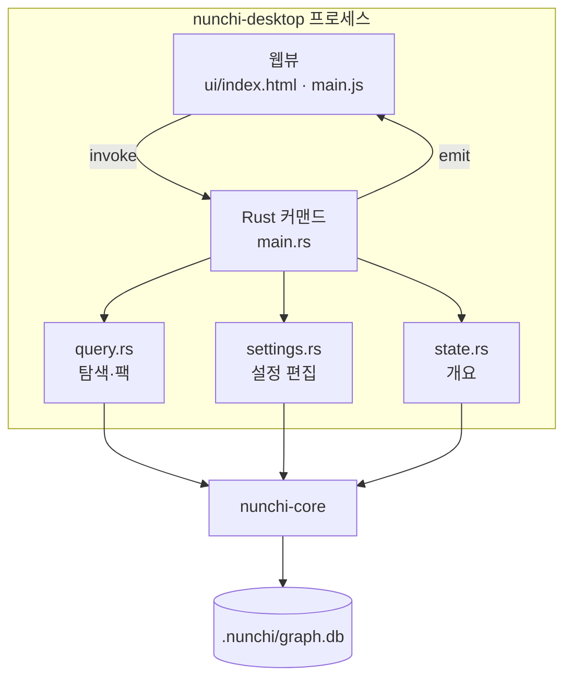

# 12. 데스크톱 앱

> **필요한 문법**: [8.2 채널 `mpsc`로 워처 만들기](../rust/08-2-channels.md),
> [5.4 `#[derive]`와 serde 속성](../rust/05-4-derive.md)

## 무엇을 하는 코드인가

[11장](11-serve-tui.md)의 TUI와 목적이 같습니다. 사람이 인덱스를 눈으로
확인하는 자리입니다. 다만 터미널 대신 창을 띄웁니다.

같은 일을 하는 화면을 하나 더 만든 이유는 두 가지입니다.

**첫째, 터미널이 불편했습니다.** TUI는 `nunchi index`가 이미 끝난 뒤에야
쓸모가 있습니다. 처음 쓰는 사람은 `nunchi init`으로 설정을 만들고
`nunchi index`로 인덱싱한 다음에야 TUI를 열 수 있었습니다. 세 단계를 모두
터미널에서 해야 했습니다.

**둘째, 폴더 경로를 손으로 입력해야 했습니다.** 이것이 결정적이었습니다.
저장소 경로는 장비마다 다르므로 처음 설정할 때 반드시 입력해야 하는데,
`/Users/windfree/Workspace/backend` 같은 문자열을 틀리지 않고 적는 일은
생각보다 성가십니다.

데스크톱 앱은 운영체제의 폴더 선택 대화상자를 띄웁니다. 이것이 웹 앱으로
만들지 않은 이유이기도 합니다. 브라우저는 보안상 로컬 절대 경로를
자바스크립트에 넘겨주지 않습니다.

## 그림



화면은 HTML과 CSS와 자바스크립트로 그리고, 실제 일은 Rust가 합니다. 둘
사이는 `invoke`와 `emit` 두 방향으로만 오갑니다.

## Tauri를 고른 이유

Tauri는 **운영체제에 이미 들어 있는 웹뷰**를 씁니다. macOS는 WKWebView,
Windows는 WebView2를 그대로 가져다 씁니다.

Electron은 크로미움을 통째로 담아 배포하므로 실행 파일이 100메가바이트를
넘어갑니다. 반면 이 앱은 브라우저를 담지 않으므로 훨씬 작습니다.

Node.js도 필요하지 않습니다. 프런트엔드 프레임워크를 쓰지 않고 정적 HTML을
그대로 담았기 때문입니다. `cargo install tauri-cli` 한 번이면 빌드할 수
있습니다.

화면 파일은 빌드할 때 실행 파일 안에 들어갑니다. `queries/*.scm`이나
`rules/*.toml`과 같은 방식입니다.

```json
"build": {
  "frontendDist": "ui"
}
```

### 반드시 켜야 하는 설정 하나

```json
"app": {
  "security": {
    "csp": "default-src 'self'; style-src 'self' 'unsafe-inline'"
  },
  "withGlobalTauri": true
}
```

`withGlobalTauri`는 Tauri 2에서 기본값이 꺼져 있습니다. 이 값을 켜지 않으면
`window.__TAURI__`가 웹뷰에 주입되지 않습니다.

프레임워크를 쓰면 번들러가 API를 모듈로 가져오므로 필요가 없습니다. 그러나
이 앱처럼 순수 자바스크립트를 쓰면 전역 객체 외에는 접근할 방법이 없습니다.

이 설정을 빠뜨렸을 때 어떻게 되는지 실제로 겪었습니다. 화면 첫 줄에서 예외가
나면서 "불러오는 중입니다"만 남고 아무 일도 일어나지 않았습니다. 오류 메시지도
나오지 않습니다.

그래서 지금은 첫 줄에서 확인하고 원인을 화면에 적습니다.

```js
const invoke = window.__TAURI__?.core?.invoke;

async function start() {
  if (!invoke) {
    fatal("Tauri API 를 찾지 못했습니다. tauri.conf.json 의 withGlobalTauri 설정을 확인하십시오.");
    return;
  }
  // ...
}
```

**흰 화면으로 두면 원인을 알 수 없습니다.** 실패했다는 사실보다 왜 실패했는지가
훨씬 중요합니다.

## 한 줄씩

### 상태를 세 가지 들고 있습니다

```rust
/// 지금 열려 있는 솔루션의 설정 파일 경로.
#[derive(Default)]
struct Opened(Mutex<Option<PathBuf>>);

/// 인덱싱이 도는 중인지. 겹쳐 실행하면 같은 데이터베이스를 두 곳에서 쓰게 된다.
#[derive(Default)]
struct Indexing(std::sync::atomic::AtomicBool);

/// 열어 둔 인덱스. 탐색과 팩이 같은 그래프를 다시 쓴다.
#[derive(Default)]
struct Session(Mutex<Option<query::Session>>);
```

`Mutex`로 감싼 이유는 Tauri 커맨드가 여러 스레드에서 불릴 수 있기 때문입니다.
상태를 그냥 두면 컴파일되지 않습니다.

`Opened`가 있는 이유는 데스크톱 앱이 **어디서 실행될지 모르기** 때문입니다.
CLI는 현재 디렉터리부터 위로 올라가며 `nunchi.toml`을 찾습니다
([2장](02-config.md)). 그러나 Finder에서 앱을 누르면 현재 디렉터리가 홈이나
루트가 됩니다. 그래서 무엇을 열었는지 앱이 직접 기억합니다.

`Indexing`이 `Mutex`가 아니라 `AtomicBool`인 이유는 참과 거짓만 다루기
때문입니다. `swap`으로 값을 바꾸면서 이전 값을 함께 받으므로, 확인과 설정이
한 번에 끝납니다.

```rust
if running.0.swap(true, std::sync::atomic::Ordering::SeqCst) {
    return Err("이미 인덱싱 중입니다.".into());
}
```

이전 값이 참이었다면 이미 누군가 돌리고 있다는 뜻입니다.

### 인덱싱은 별도 스레드에서 돌립니다

```rust
std::thread::spawn(move || {
    let result = run_index(&app, &config_path, rebuild);
    // 그래프가 통째로 바뀌었으므로 들고 있던 것을 버린다.
    drop_session(&app);
    app.state::<Indexing>()
        .0
        .store(false, std::sync::atomic::Ordering::SeqCst);
    let payload = match result {
        Ok(stats) => serde_json::json!({ "ok": true, "stats": stats }),
        Err(e) => serde_json::json!({ "ok": false, "error": e.to_string() }),
    };
    let _ = app.emit("index-done", payload);
});
```

커맨드 안에서 그대로 인덱싱하면 그동안 창이 얼어붙습니다. 웹뷰는 응답을
기다리는 동안 아무것도 그리지 못합니다.

그래서 스레드를 띄우고 커맨드는 곧바로 돌아옵니다. 결과는 이벤트로 보냅니다.

### 진행 상황을 코어가 알려 줍니다

인덱싱이 도는 동안 무슨 일이 벌어지는지 보여 주려면 `nunchi-core`가 말해
주어야 합니다. 그래서 알림 종류를 열거형으로 정의했습니다.

```rust
#[derive(Debug, Clone, serde::Serialize)]
#[serde(tag = "stage", rename_all = "snake_case")]
pub enum Progress {
    RepoStarted { repo: String, index: usize, total: usize },
    Scanning { repo: String, files: usize },
    Resolving,
    History,
    Saving,
}

pub type ProgressFn<'a> = &'a mut dyn FnMut(Progress);
```

`#[serde(tag = "stage")]`가 붙어 있으므로 자바스크립트에는 이렇게 도착합니다.

```json
{ "stage": "scanning", "repo": "backend", "files": 120 }
```

`Scanning`은 파일 스무 개마다 한 번만 보냅니다. 파일마다 보내면 화면이 갱신을
따라가지 못합니다.

기존 함수는 그대로 두고 빈 클로저를 넘기게 했습니다. CLI와 MCP 서버는 손댈
필요가 없습니다.

```rust
pub fn index_all_with_cache(
    config: &Config,
    store: &mut SqliteStore,
    cache: Option<&mut crate::cache::ExtractCache>,
) -> Result<IndexStats> {
    index_all_with_progress(config, store, cache, &mut |_| {})
}
```

처음에는 콜백을 `Option<&mut dyn FnMut>`으로 받으려 했는데, 반복문 안에서
같은 값을 여러 번 빌리게 되어 컴파일되지 않았습니다. 언제나 받되 필요 없으면
빈 클로저를 넘기는 편이 간단합니다.

### 인덱스를 한 번만 읽습니다

탐색과 팩은 그래프가 있어야 동작합니다. 화면을 누를 때마다 그래프를 다시
읽으면 느려집니다.

```rust
pub struct Session {
    pub config_path: PathBuf,
    config: Config,
    store: SqliteStore,
    graph: MemGraph,
    roots: HashMap<String, PathBuf>,
}
```

한 번 열어 두고 계속 씁니다. 다만 **버려야 할 때가 있습니다.** 인덱싱을 다시
했거나, 설정을 고쳤거나, 다른 솔루션을 열었을 때입니다. 그때는
`drop_session`을 부릅니다. 다음에 필요해지면 그때 다시 엽니다.

```rust
fn with_session<T>(
    app: &tauri::AppHandle,
    f: impl FnOnce(&mut query::Session) -> Result<T, String>,
) -> Result<T, String> {
    let Some(config_path) = current(app) else {
        return Err("먼저 솔루션을 여십시오.".into());
    };
    let state = app.state::<Session>();
    let mut slot = state.0.lock().map_err(|_| "상태를 읽지 못했습니다.".to_string())?;
    // 다른 솔루션을 열었으면 들고 있던 것을 버리고 새로 연다.
    if slot.as_ref().is_none_or(|s| s.config_path != config_path) {
        *slot = Some(query::Session::open(&config_path).map_err(|e| e.to_string())?);
    }
    f(slot.as_mut().expect("바로 위에서 채웠다"))
}
```

`is_none_or`는 "값이 없거나, 있는데 조건을 만족하는가"를 확인합니다
([2.1장](../rust/02-1-option.md)의 `is_some_and`와 짝을 이룹니다).

### 탐색과 팩은 코어를 그대로 부릅니다

```rust
pub fn search(&self, query: &str, limit: usize) -> Result<Vec<Hit>> {
    let expanded = self.config.semantic.expand_query(query);
    Ok(self
        .store
        .search(&expanded, limit)?
        .iter()
        .map(|h| hit(&h.node, h.score))
        .collect())
}
```

TUI가 하던 것과 같습니다([11장](11-serve-tui.md)). 넘기고 받는 일만 합니다.

이웃을 찾을 때는 따라갈 엣지 종류를 골라 줍니다.

```rust
let kinds = [
    EdgeKind::Calls,
    EdgeKind::Injects,
    EdgeKind::CallsApi,
    EdgeKind::Handles,
];
```

`Contains`를 넣지 않은 것이 중요합니다. 담고 있다는 관계까지 따라가면 같은
파일의 심볼이 전부 딸려 나와 목록이 쓸모없어집니다.

깊이는 기본값이 1홉입니다. 2홉으로 올리면 자주 쓰이는 함수에서 수백 건이
나옵니다. 실제로 이 저장소의 `index_all_with_cache`를 2홉으로 조회하면
220건이 나왔습니다.

## 설정 편집

사용자가 이 앱을 원한 이유 중 하나가 설정 파일 편집이었습니다. 다만 설정을
전부 폼으로 만들면 항목이 늘어날 때마다 화면을 고쳐야 합니다.

그래서 두 가지를 함께 제공합니다.

| 방식 | 다루는 것 |
|---|---|
| 폼 | 이름, 언어, 제외 패턴, 파일 크기 상한, 커밋 수, 후보 상한, 도메인 용어 |
| 원문 | 나머지 전부. 특히 프레임워크 규칙([5장](05-framework.md)) |

### 주석을 지우지 않고 저장합니다

`Config::save`는 설정을 통째로 다시 씁니다. 그러면 손으로 적은 주석이
사라집니다.

이 프로젝트에서 주석은 단순한 설명이 아닙니다. `rules/builtin.java.toml`을
보시면 "실측에서 오탐이 21건 중 16건이었다" 같은 판단의 근거가 적혀
있습니다. 규칙을 왜 그렇게 정했는지가 값 자체보다 중요할 때가 많습니다.

그래서 `toml_edit`으로 **바꿀 키만 갈아 끼웁니다.**

```rust
let mut local = open_doc(config_path)?;
table(&mut local, "solution")?.insert("name", string(&form.name));
let index = table(&mut local, "index")?;
index.insert("languages", inline_array(&form.languages));
index.insert("exclude", block_array(&form.exclude));
index.insert("max_file_bytes", int(form.max_file_bytes as i64));
write_doc(config_path, &local)?;
```

`toml_edit`은 파싱한 뒤에도 원래 형식과 주석을 그대로 들고 있습니다. 값 하나를
바꾸고 다시 문자열로 만들면 나머지는 손대지 않은 채 남습니다.

테스트로 확인합니다.

```rust
/// 폼에 없는 항목과 주석이 저장 뒤에도 남아 있어야 한다.
#[test]
fn keeps_comments_and_unknown_keys() {
    // ...
    save(&path, &form()).unwrap();
    let text = std::fs::read_to_string(&path).unwrap();
    assert!(text.contains("# 손으로 적은 메모"));
    assert!(text.contains("/tmp/a"));
    assert!(text.contains("name = \"demo\""));
    // ...
}
```

### 두 파일에 나누어 씁니다

[2장](02-config.md)에서 본 것처럼 설정은 파일 두 개로 나뉩니다. 경로가 들어
있는 `nunchi.toml`은 커밋하지 않고, `nunchi.shared.toml`은 커밋합니다.

불러올 때 공용 파일이 나중에 덮어씁니다. 그래서 경로가 없는 값은 **양쪽에 모두**
써야 합니다. 한쪽만 고치면 화면에 보이는 값과 실제로 쓰이는 값이 어긋납니다.

### 저장하기 전에 읽어 봅니다

원문 편집기는 사용자가 무엇이든 적을 수 있는 자리입니다. 깨진 TOML을 그대로
쓰면 다음에 앱을 열 때 설정을 읽지 못합니다.

```rust
match which {
    "local" => {
        toml::from_str::<Config>(text)
            .with_context(|| format!("{}의 내용이 설정 형식에 맞지 않습니다", CONFIG_FILE))?;
    }
    _ => {
        toml::from_str::<SharedConfig>(text).with_context(|| {
            format!("{}의 내용이 공용 설정 형식에 맞지 않습니다", SHARED_FILE)
        })?;
    }
}
std::fs::write(&path, text)
```

문법만 보는 것이 아니라 **실제 설정 타입으로 읽어 봅니다.** 그래야
`max_commits = "많이"`처럼 문법은 맞지만 타입이 틀린 것도 걸러집니다.

읽기에 실패하면 파일을 건드리지 않고 오류를 화면에 보여 줍니다.

## 왜 이렇게 썼는가

### 왜 `init`을 코어로 옮겼는가

원래 `nunchi init`의 로직은 CLI 안에 있었습니다. 앱에서도 같은 일을 해야
했으므로 `nunchi-core/src/init.rs`로 옮겼습니다.

CLI와 앱이 각자 구현했다면 한쪽에서 만든 설정을 다른 쪽이 이상하게 읽는 일이
생겼을 것입니다. 이 프로젝트가 로직을 전부 라이브러리에 두는 이유와
같습니다([0장](00-map.md)).

### 왜 화면을 통째로 다시 그리는가

프레임워크를 쓰지 않으므로 상태가 바뀌면 `innerHTML`을 통째로 갈아 끼웁니다.
부분 갱신을 직접 관리하는 것보다 훨씬 단순합니다.

다만 한 가지 문제가 생깁니다. **다시 그리면 입력 칸의 포커스와 커서 위치가
사라집니다.** 검색어를 넣는 도중에 결과가 도착하면 타이핑이 끊깁니다.

그래서 다시 그리기 전후로 포커스를 되돌려 놓습니다.

```js
function show(name) {
  const focused = document.activeElement?.id;
  const caret = document.activeElement?.selectionStart;

  document.getElementById("view").innerHTML = views[name]();
  // ...

  if (focused) {
    const again = document.getElementById(focused);
    if (again) {
      again.focus();
      if (caret != null && again.setSelectionRange) {
        try {
          again.setSelectionRange(caret, caret);
        } catch {
          // 범위를 다룰 수 없는 입력 종류가 있다. 포커스만 살리면 충분하다.
        }
      }
    }
  }
}
```

가중치 슬라이더만은 예외입니다. 움직일 때마다 다시 그리면 손을 뗀 것처럼
되므로, 숫자 표시만 직접 바꿉니다.

### 왜 CLI를 대체하지 않는가

앱이 생겼다고 해서 CLI가 없어지지 않습니다. 두 가지 이유가 있습니다.

**자동화 때문입니다.** 저장소 여러 개에 같은 작업을 하려면 스크립트가
필요합니다. 사람이 창 앞에 앉아야만 되는 작업이 있으면 그것이 불가능해집니다.

**에이전트 때문입니다.** MCP 서버가 실제 사용자입니다. 앱은 사람이 인덱스를
확인하고 설정을 맞추는 자리이고, 에이전트는 여전히 MCP로 붙습니다.

그래서 앱에도 고유 기능을 두지 않습니다. TUI와 같은 규칙입니다
([11장](11-serve-tui.md)).

## 정리

데스크톱 앱은 Tauri 2로 만들었습니다. 운영체제의 웹뷰를 쓰므로 브라우저를
담지 않고, 프런트엔드 프레임워크를 쓰지 않으므로 Node.js도 필요 없습니다.

`withGlobalTauri`를 켜지 않으면 화면이 아무것도 하지 않은 채 멈춥니다. 기본값이
꺼져 있으므로 반드시 확인해야 합니다.

인덱싱은 별도 스레드에서 돌리고 진행 상황을 이벤트로 보냅니다. 그러지 않으면
도는 동안 창이 얼어붙습니다.

설정은 폼과 원문 두 가지로 고칩니다. `toml_edit`으로 바꿀 키만 갈아 끼우므로
손으로 적은 주석이 남습니다. 원문은 저장하기 전에 실제 설정 타입으로 읽어
봅니다.

앱은 코어를 부르기만 합니다. CLI와 MCP 서버와 TUI가 같은 함수를 부르므로 네
통로가 같은 결과를 냅니다.

이것으로 2권이 끝났습니다. 실행 흐름을 처음부터 끝까지 따라왔습니다.
